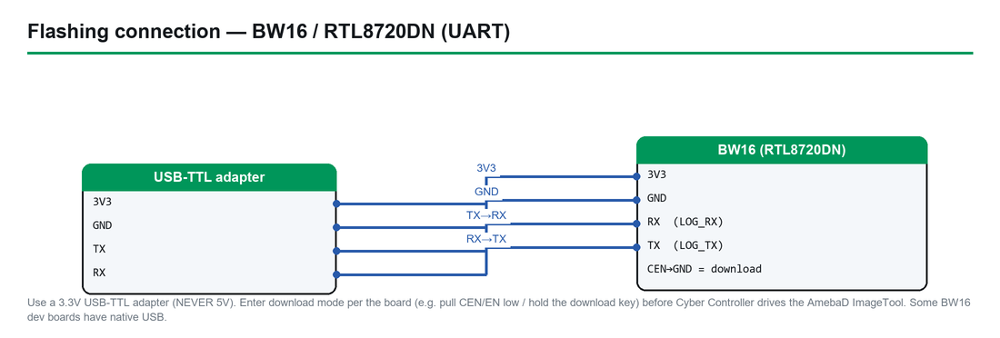

# BlueJammer-V2 (BW16 Controller) — Complete Hardware Guide

> **Firmware:** BlueJammer-V2 — BW16 controller half · **Upstream:** [EmenstaNougat/BlueJammer-V2](https://github.com/EmenstaNougat/BlueJammer-V2) (closed-source, pre-compiled bins)
> **Chip:** RTL8720DN (Ai-Thinker/B&T **BW16**, dual-band 2.4/5 GHz WiFi + BLE 5.0) · **Cyber Controller profile:** `bluejammer-bw16` (slug `bluejammer-bw16`, `rtl8720` backend, AmebaD ImageTool, pinned SHA-256 bundle, no suicide)
> **This guide:** purchase → build → **flash-and-study only** → integrate into Cyber Controller → lab handling → troubleshoot.
> **⚠ LAB-ONLY / ILLEGAL TO OPERATE — see §2 before doing anything.**

## 1. Overview
BlueJammer-V2 is a **two-board RF-research platform** by Emensta: an **ESP32-WROOM-32U jamming engine** (with up to 4× nRF24L01+ modules and a 128×64 OLED) paired with an **Ai-Thinker BW16 (RTL8720DN) controller**. This guide covers **only the BW16 controller half** — the chip Cyber Controller actually flashes.

The BW16's job in this platform is **control, not RF emission**: it hosts a self-contained 5 GHz WiFi access point and a web UI, acts as the **UART master** to the ESP32 engine, and bridges the engine's telemetry (mode, nRF module status, serial log) into that web page. The four jamming *modes* (Bluetooth / BLE / WiFi / RC-Drone) are executed by the ESP32 + nRF24 side, not the BW16. The RTL8720DN is a dual-core part (KM4 Cortex-M33 @200 MHz + KM0) on Realtek's **AmebaD** platform, which is why it is flashed with Realtek's AmebaD image toolchain rather than esptool.

Cyber Controller's role is narrow and deliberate: it **flashes the pinned, SHA-256-verified AmebaD firmware bundle to the BW16 via the `rtl8720` backend, and nothing more.** There is **no serial command channel** on the controller firmware, so Cyber Controller **cannot and does not operate, key, or transmit** anything. The device's only operating surface is its own web UI + physical button — documented here, **not driven**.

## 2. Legal & Safety — READ THIS FIRST

> ### 🚫 RF JAMMING IS ILLEGAL TO OPERATE. THIS IS A FLASH-AND-STUDY ARTIFACT ONLY.
> Operating an RF jammer is a **federal crime in the United States** under **47 U.S.C. § 333** ("No person shall willfully or maliciously interfere with or cause interference to any radio communications of any station licensed or authorized…") and is prohibited by **FCC rules (Parts 2/15)** — the FCC states jammers may not be operated, marketed, or sold, with penalties including **fines exceeding $100,000, equipment seizure, and imprisonment**. Jamming is **similarly illegal in virtually every other jurisdiction worldwide** (e.g. UK Wireless Telegraphy Act, EU radio regulations, Canada, Australia). Even *possession* or *import* is restricted in some places.

**What this guide authorizes:** flashing the BW16 controller firmware and **studying the device on a bench**. Nothing more.

**What this guide does NOT do — by design:**
- It gives **no transmit, keying, or jamming instructions.** The "modes" are listed only to document the control surface.
- Cyber Controller has **no operate/transmit control** over this profile (`danger: illegal-tx`, no serial command channel). It flashes; it does not run the jammer.

**If you choose to power the assembled platform at all**, do so **only inside a fully enclosed, authorized RF-shielded environment** (a properly rated **RF anechoic/shielded chamber or Faraday enclosure** with no leakage) under an institution's spectrum/lab authorization. **Do not transmit over the air, ever.** Energising the nRF24 stage outside such an enclosure — even briefly, even "just to test" — is the illegal act. When in doubt, **keep the RF stage unpowered** and study the BW16 controller/web UI in isolation.

This guide is for education, security research, and lab study by people who will obey the law. You are solely responsible for compliance.

## 3. Hardware & Purchasing
You only need the **BW16 controller module** for the part Cyber Controller flashes. The rest (ESP32, nRF24s) belongs to the RF engine and is intentionally out of scope here.

| Part | What to get | Why | Where to buy (search terms) |
|------|-------------|-----|------------------------------|
| **Controller (this guide)** | **Ai-Thinker / B&T BW16 (RTL8720DN)** module | The chip CC flashes; dual-band 2.4/5 GHz WiFi + BLE 5.0, KM4+KM0 cores | Search **"BW16 RTL8720DN module"** on AliExpress/Amazon; also **"BW16 Type-C RTL8720DN dev board"**. Maker: Ai-Thinker (B&T) |
| USB-UART (if bare module) | **CP2102 / CH340 USB-TTL adapter (3.3 V)** | BW16 flashes over UART, not native USB | AliExpress/Amazon: "CP2102 USB to TTL 3.3V" |
| Data cable | Quality **USB data cable** (not charge-only) | Needed for the USB-Type-C BW16 variant / for the UART adapter | any reputable vendor |

**Notes & verify-before-you-buy:**
- The Cyber Controller profile records this board as **`bw16-rtl8720dn`, flash size `2MB`**. Some BW16 variants (e.g. **BW16 Type-C / BW16E**) ship with more flash — **verify: confirm your specific module's flash size and pinout against its datasheet**; the AmebaD bundle here targets the standard BW16.
- Genuine **emensta / official source:** upstream warns *"If you purchased this device from anyone other than official sources at emensta.pages.dev — you have been scammed."* **Verify the seller** before buying a pre-assembled BlueJammer-V2; this guide does not endorse any reseller.
- **Avoid invented links.** Use the search strings above; vendor URLs and stock change constantly — confirm at purchase time (§9).

## 4. Building / Assembly (controller side)
The BW16 here is the **UART-master controller**. Assembly relevant to *flashing and studying the controller*:

- **Bare BW16 module:** wire your USB-UART adapter to the BW16's **LOG_UART** pins (cross **TX↔RX**), **3V3**, and **GND**. The **BW16 Type-C** variant has onboard USB and needs only a data cable.
- **Within the full BlueJammer-V2 platform** (documented for completeness — RF stage stays unpowered outside a shielded lab):
  - BW16 ↔ ESP32 link is **UART @ 115200 baud**, **TX/RX crossed**: ESP32 TX (GPIO33 → PB2) to BW16 RX, ESP32 RX (GPIO26 ← PB1) to BW16 TX. A 2 s heartbeat / `LINKOK` handshake runs over this link.
  - Power: *"Both boards share 3.3 V and GND. The BW16 can be powered directly from the ESP32's 3V3 rail."*
  - The nRF24 + ESP32 jamming engine (quad nRF24L01+, 10 µF decoupling per module mandatory, OLED on I²C) is the **RF-emitting** half — **not** flashed by this profile and **not to be energised outside a shielded chamber** (§2).
- **Drivers (host):** install the USB-serial driver for your adapter/board — **CP210x** or **CH340** — or no COM port appears.

## 5. Flashing & First Run (via Cyber Controller)

*How to connect the BW16/RTL8720DN over a 3.3V USB-TTL adapter for AmebaD flashing.*

Cyber Controller flashes the BW16 controller using the **`rtl8720` backend** (Realtek **AmebaD ImageTool / `upload_image_tool`**), the same flow as the standalone `rtl8720` profile.

**One-time host prerequisite (AmebaD tool):** the `rtl8720` backend needs **Realtek's `upload_image_tool`** on the host (it is **not bundled** — closed/GPL constraints). Provide it via the **`CYBERC_AMEBAD_TOOL`** env var, or drop it in **`tools/realtek/`** (on **Windows** include **`cygwin1.dll`** alongside it).

1. Connect the BW16 by USB (Type-C variant) or via the USB-UART adapter; open Cyber Controller → **Flash** tab.
2. **Port:** select the BW16's COM/tty (click *Refresh* if missing → driver issue).
3. **Firmware Profile:** **`BlueJammer-V2 — BW16 controller [LAB-ONLY / illegal to operate]`** (id `bluejammer_bw16`, core `bluejammer-bw16`).
4. **Enter download mode on the BW16** when prompted: **hold `BURN` → press & release `RST` → release `BURN`.** (The AmebaD loader can also assert it via DTR/RTS on supported wiring.)
5. Click **Flash.** Cyber Controller, via the `rtl8720` backend:
   - Fetches the **pinned v0.2 release bundle** — `km0_boot_all.bin`, `km4_boot_all.bin`, `km0_km4_image2.bin` — plus the shared **`imgtool_flashloader_amebad.bin`** SRAM loader (reused from the rtl8720 bundle).
   - **Verifies every file's SHA-256** before writing (see §6 for the pinned digests). A mismatch aborts the flash.
   - Uploads the SRAM flashloader, then writes the AmebaD images (app offset `0x0`, `merged-single-bin` image model). Monitor/CLI baud is **115200**; the AmebaD loader negotiates **~1.5 Mbaud** for the transfer itself.
6. **First run:** after reset the BW16 brings up its self-hosted AP **`BlueJ-V2_by_@emensta`** on a 5 GHz channel (default **149**). Confirming the controller is alive (it advertises its AP) is the extent of "first run" here — **do not select a jamming mode / do not key the RF engine** (§2).

## 6. Integrate into Cyber Controller
- **Profile:** `bluejammer-bw16` — `backend: rtl8720`, `protocol: bluejammer`, `danger: illegal-tx`, `supports_suicide: false`, `resolver: pinned_release` (`tag: v0.2`), `app_offset: 0x0`, `image_model: merged-single-bin`.
- **Firmware source:** `EmenstaNougat/BlueJammer-V2`, pinned release **v0.2** (`…/releases/download/v0.2`); the SRAM loader comes from the rtl8720 raw bundle. Firmware is **closed-source**: bins are **pinned and SHA-256-verified, never vendored** into the repo.
- **Pinned SHA-256 digests** (what CC enforces):
  - `km0_boot_all.bin` → `453c880307fc389009aa8a39c63da3d715b207ad797206c896cc691426daaa64`
  - `km4_boot_all.bin` → `05fbf808d43113eaf7c11b75091c986b817135f0c52eb9fa94bb9fe9f34b062c`
  - `km0_km4_image2.bin` → `615c382d48b89e1faceeba0ac586538894a21d4eeb4dc0c64027fcb271a84ef9`
  - `imgtool_flashloader_amebad.bin` → `9307121385cb390dfd2da64da2c6c515f17b5a9556b3d04021487c9b9f220b55`
  - *(Note: `km0_km4_image2.bin` here is the BlueJammer-V2 v0.2 image — a different digest from the standalone `rtl8720` Vampire-Deauther image; the boot files and SRAM loader are shared.)*
- **Control surface — documented, NOT driven:** the device is operated only from its **self-hosted web UI** (join AP `BlueJ-V2_by_@emensta` / pass `NoConn1337` → `http://192.168.1.1`) plus the physical button. The web UI exposes mode buttons (**Bluetooth, BLE, WiFi, RC/Drone, Idle**), nRF module status, a live serial monitor/command log, OLED brightness (0–100 %), and AP timeout/shutdown settings. **There is no serial command channel**, so Cyber Controller **cannot key the transmitter** — and, per the illegal-to-operate framing, **does not**. Any future in-app control panel would have to POST to the web UI's mode endpoints (which must be captured on real hardware first) and would be **gated behind the `illegal-tx` confirmation**.
- **No Dead Man's Switch / suicide:** `supports_suicide: false` for this profile.
- **Backup first:** use **Backup** in the Flash tab to dump the BW16's current flash before overwriting.

## 7. Usage (lab study only — NO transmit)
This section is intentionally **not** an operating manual. There are **no jamming instructions** here.

1. **Flash & verify (the supported action):** flash the controller per §5; confirm CC reports success and the SHA-256 checks passed.
2. **Confirm the controller booted:** with the **RF engine unpowered**, the BW16 should advertise its AP `BlueJ-V2_by_@emensta`. Seeing the AP / reaching `http://192.168.1.1` confirms the controller firmware is healthy. **Leave the mode set to `Idle`.**
3. **Study the web UI as an artifact:** inspect the page structure, telemetry fields, and link/handshake (`LINKOK`) behaviour between BW16 and ESP32 — **without selecting a jamming mode and without energising the nRF24 stage.**
4. **Do not transmit.** Selecting Bluetooth/BLE/WiFi/RC-Drone and powering the RF stage outside a properly authorized, fully enclosed RF-shielded chamber is the **illegal act** (§2). If you have no such facility, **keep the RF stage unpowered** — study the controller in isolation.
5. **Re-flash / restore:** to return the BW16 to other firmware, re-flash via the appropriate profile (e.g. the standalone `rtl8720` profile) using the same AmebaD flow.

## 8. Troubleshooting
- **No COM port:** install the **CP210x/CH340** driver for your adapter/BW16; try another **data** cable; on Linux add your user to `dialout` and replug.
- **`upload_image_tool` not found / flash won't start:** set **`CYBERC_AMEBAD_TOOL`** or place the tool in **`tools/realtek/`** (Windows: include **`cygwin1.dll`**). This is the most common AmebaD failure.
- **Flash fails to connect / loader won't upload:** re-enter download mode — **hold `BURN`, press & release `RST`, release `BURN`** — then retry; close any serial monitor holding the port; verify TX/RX are **crossed** on a bare module.
- **SHA-256 mismatch / download aborts:** CC refuses to flash unverified bins — a corrupted download or an upstream asset change is the usual cause; clear the cache and retry, and **verify the release tag is still v0.2**.
- **AP `BlueJ-V2_by_@emensta` not visible after flash:** the AP is on a **5 GHz channel (default 149)** — use a 5 GHz-capable client; confirm the controller actually booted (re-flash if download mode was missed mid-write).
- **Wrong-flash / boot issues:** confirm the module is a genuine **BW16 RTL8720DN** and **verify its flash size** (profile assumes `2MB`); a mismatched variant can fail to boot.
- **Bricked controller:** re-run the AmebaD flash from download mode; the 3-file bundle + SRAM loader is the full image set, so a clean re-flash normally recovers it.

## 9. Sources
- Upstream firmware: <https://github.com/EmenstaNougat/BlueJammer-V2> (README, Firmware-Flasher, v0.2 release) — closed-source, pre-compiled bins. Official device source per upstream: emensta.pages.dev. Related upstream repos: `EmenstaNougat/ESP32-BlueJammer`, `EmenstaNougat/BW16-BlueJammer`.
- Cyber Controller profile: `src/config/profiles/bluejammer_bw16.json` (backend, pinned v0.2 assets + SHA-256, control surface, danger flag) and `src/config/profiles/rtl8720.json` (shared AmebaD backend behaviour, baud, download mode).
- BW16 / RTL8720DN module: Realtek AmebaD platform; Ameba Arduino docs and BW16 troubleshooting guides (forum.amebaiot.com), `pushtoopen/BW16_RTL8720`, Hackster.io BW16 getting-started/troubleshooting. **Verify your module's exact flash size and pinout against its datasheet.**
- Legal: **47 U.S.C. § 333** and FCC jammer-enforcement guidance (FCC Parts 2/15); equivalent prohibitions worldwide. Confirm current law in your jurisdiction before any RF work.
- Verify board availability, prices, the upstream release tag/digests, and current law at the time of use — links, stock, and statutes change.
