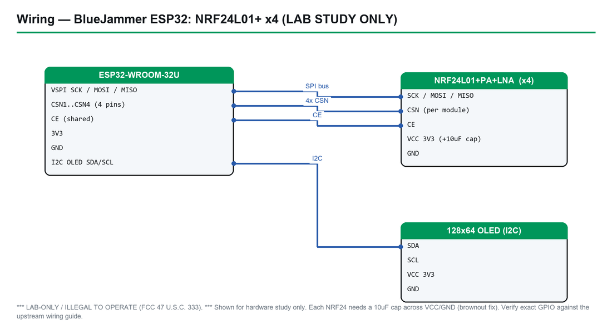

# BlueJammer-V2 (ESP32 engine) — Complete Hardware Guide

> ## ⚠️ LAB-ONLY — ILLEGAL TO OPERATE
> **This device is an RF jammer. Transmitting with it is a federal crime in the United States (47 U.S.C. §333) and is prohibited in nearly every other country.** This guide covers how to *flash* and *study* the firmware in an authorized, RF-shielded lab **only**. It contains **no** operating, tuning, or transmit instructions. See [Section 2](#2-legal--safety-read-this-first) before anything else.

> **Firmware:** BlueJammer-V2 (ESP32 engine) · **Upstream:** [EmenstaNougat/BlueJammer-V2](https://github.com/EmenstaNougat/BlueJammer-V2) (closed-source / precompiled)
> **Chip:** ESP32-WROOM-32U (`esp32`, 4 MB) · **Cyber Controller profile:** `bluejammer-esp32` (esptool backend, multi-file offsets, SHA-256-verified pinned v0.2, **no** suicide/erase)
> **Drives:** up to 4× nRF24L01+ modules + 128×64 SSD1306 OLED, with a companion Ai-Thinker BW16 board hosting a 5 GHz web UI.
> **This guide:** purchase → build (hardware study) → flash → integrate into Cyber Controller → study telemetry → troubleshoot. **Cyber Controller flashes and reads telemetry only — it exposes no operate/transmit control.**

## 1. Overview
BlueJammer-V2 is a two-board 2.4 GHz RF "research platform" from EmenstaNougat. The **ESP32-WROOM-32U** acts as the jamming engine: it drives up to **four nRF24L01+ transceivers** in a round-robin pattern, shows status on a **128×64 SSD1306 OLED**, and talks over UART (115200 baud) to a companion **Ai-Thinker BW16 (RTL8720DN)** board that hosts a 5 GHz Wi-Fi access point and a web control UI. The firmware ships as **closed-source, precompiled binaries** (current pinned release **v0.2**); there is no public source tree.

Cyber Controller integrates **only the ESP32 engine**, and only for two narrow, lawful purposes:
- **Flashing** the pinned, SHA-256-verified v0.2 image to the ESP32-WROOM-32U.
- **Reading telemetry** (the device's status/diagnostic serial output) for study.

Cyber Controller adds **no jamming capability** and **exposes no transmit control**. The device's only transmit triggers are its **physical button** and the **BW16-hosted web UI** — neither is driven by Cyber Controller. This guide treats the hardware purely as an object of study.

## 2. Legal & Safety (READ THIS FIRST)
**Operating this device is illegal.** An RF jammer deliberately emits interference to deny others the use of a radio band. In the United States this is barred by **47 U.S.C. §333** (willful or malicious interference with licensed/authorized radio communications) and by **47 CFR §2.803 / §15** (marketing and operating uncertified intentional radiators). The FCC has levied **five- and six-figure penalties** against individual jammer operators. There is **no exception** for "personal", "quiet zone", "classroom", or "just testing" use.

- **Worldwide:** Jamming is likewise prohibited under the UK Wireless Telegraphy Act, Canada's Radiocommunication Act, the EU RED/national spectrum laws, Australia's Radiocommunications Act, and equivalents almost everywhere. Importing or selling jammers is independently illegal in many of these jurisdictions.
- **It is dangerous, not just illegal:** 2.4 GHz jamming can knock out Wi-Fi, Bluetooth medical/IoT devices, drones, security systems, and more. Interfering with safety-of-life or emergency communications carries severe criminal liability.

**What this guide permits, and nothing more:**
- Flashing the firmware to study the binary, boot process, and pin map.
- Reading the device's telemetry/serial output.
- Doing the above **only** inside a properly **RF-shielded enclosure (Faraday cage / shielded test chamber)** where no emission can leave the chamber, under an authorized research or engineering context.

**What this guide deliberately does NOT provide:** any instruction on how to transmit, select bands/channels, tune output, aim, or otherwise *operate* the jammer. The four jamming "modes" present in the firmware are described in [Section 7](#7-usage-lab-study--flashing--telemetry-only) only as static facts about the binary — never as instructions. If your goal is to operate this device on the air, **stop: that is the illegal act this guide exists to keep you away from.**

Cyber Controller marks this profile `danger: illegal-tx` and deliberately ships **no** transmit/operate verbs for it; it can only flash and read.

## 3. Hardware & Purchasing
The build is two MCUs plus RF front-ends, a display, and decoupling parts. Cyber Controller only flashes the **ESP32**; the BW16 is flashed separately with the vendor's tool (see [Section 5](#5-flashing--first-run-via-cyber-controller)).

| Part | What to get | Notes | Where to buy (search terms) |
|------|-------------|-------|------------------------------|
| **Jamming MCU** | **ESP32-WROOM-32U** DevKit (4 MB flash, **U** = u.FL external antenna) | The profile targets `esp32-wroom-32u`; the `-U` variant exposes a u.FL connector. A plain WROOM-32 (PCB antenna) is the same silicon but lacks the external-antenna jack — *verify your board's flash is ≥4 MB*. | AliExpress/Amazon: **"ESP32-WROOM-32U"**, **"ESP32 DevKit WROOM-32U u.FL"** |
| **RF modules (×1–4)** | **nRF24L01+** (the **+PA+LNA** SMA variant for range) | Up to four are supported. The **PA+LNA** modules draw far more current and are notorious for brownout — *they generally need their own clean 3.3 V supply / adapter board* (verify against your module's datasheet). | AliExpress/Amazon: **"nRF24L01+PA+LNA"**, **"nRF24L01 SMA"** |
| **Display** | **0.96" SSD1306 OLED, 128×64, I²C** (addr 0x3C) | I²C 4-wire; 0x3D is selectable in firmware. | AliExpress/Amazon: **"0.96 SSD1306 OLED I2C 128x64"** |
| **Web-UI / 5 GHz board** | **Ai-Thinker BW16 (RTL8720DN)** | Hosts the web UI + 5 GHz AP; flashed with `amebatool`, **not** by Cyber Controller. | AliExpress/Ai-Thinker: **"Ai-Thinker BW16 RTL8720DN"** |
| **Decoupling** | **10 µF electrolytic capacitor ×(one per nRF24 module)** | "Not optional" per upstream — soldered across each module's VCC/GND. | Mouser/DigiKey/AliExpress: **"10uF electrolytic capacitor"** |
| **Status LED** | 3 mm/5 mm LED + current-limiting resistor (~330 Ω–4.7 kΩ) | On GPIO27. *Verify resistor value for your LED* — upstream wiring text on this is ambiguous. | Any electronics kit |
| **Cabling/power** | Data-capable **USB cable** (not charge-only); jumper wires; clean **3.3 V** rail w/ common GND | Both boards share a 3.3 V rail and common ground. | — |

**Antennas:** the `-U` ESP32 and the PA+LNA nRF24 modules use external antennas — but per [Section 2](#2-legal--safety-read-this-first), any antenna is for **bench/shielded study only**, never on-air operation.

## 4. Building / Assembly (hardware study)

*Pin layout & connections — verify exact GPIO against the upstream schematic and the table below.*

This section documents the wiring **as published upstream**, for understanding the device — not as a step toward operating it. Confirm every pin against the upstream README/wiring images before trusting it (*verify: upstream README pinout tables and photos*).

**nRF24L01+ → ESP32-WROOM-32U** (up to four modules; NRF3/NRF4 share the SPI buses of NRF1/NRF2):

| Module | Bus | CE | CSN | SCK | MOSI | MISO |
|--------|-----|----|-----|-----|------|------|
| NRF1 | HSPI | GPIO16 | GPIO15 | GPIO14 | GPIO13 | GPIO12 |
| NRF2 | VSPI | GPIO22 | GPIO21 | GPIO18 | GPIO23 | GPIO19 |
| NRF3 | HSPI (shared w/ NRF1) | GPIO32 | GPIO17 | GPIO14 | GPIO13 | GPIO12 |
| NRF4 | VSPI (shared w/ NRF2) | GPIO25 | GPIO2  | GPIO18 | GPIO23 | GPIO19 |

Every module: **VCC → 3.3 V, GND → GND, with a 10 µF electrolytic cap across VCC/GND** ("not optional" — the nRF24 is very sensitive to power-rail noise; the cap is the brownout fix). Modules are hot-pluggable and auto-detected (~every 500 ms per upstream).

**Other peripherals → ESP32:**

| Peripheral | Signal | ESP32 GPIO | Notes |
|------------|--------|------------|-------|
| OLED (SSD1306, I²C) | SDA | GPIO4 | addr 0x3C (0x3D configurable) |
| OLED | SCL | GPIO5 | |
| Button | — | GPIO0 | to GND (also the boot-strap pin) |
| Status LED | — | GPIO27 | via current-limiting resistor |
| BW16 UART | RX (from BW16) | GPIO26 | ← BW16 **PB1** |
| BW16 UART | TX (to BW16) | GPIO33 | → BW16 **PB2** |

**Power & integrity notes (study):**
- Both boards run on a **shared 3.3 V rail with common GND**; inter-board link is UART at **115200 baud**.
- **GPIO0** is both the button and the ESP32 boot-strap pin — holding it at flash time is also how you force download mode (see [Section 8](#8-troubleshooting)).
- **GPIO2** (NRF4 CSN) is also a boot-strap/onboard-LED pin on many DevKits — a likely source of "fourth module flaky" behavior; note it when studying the design.
- PA+LNA modules + four-module loads make a stiff, well-decoupled 3.3 V supply essential; the per-module 10 µF cap is the minimum, and a separate regulator for PA+LNA modules is commonly required (*verify per module datasheet*).

**Pre-built boards:** none — BlueJammer-V2 is a DIY wiring build. Cyber Controller does not assemble or wire anything; it only flashes the ESP32 once built.

## 5. Flashing & First Run (via Cyber Controller)

*How to connect the board to flash it (classic ESP32 — BOOT/EN download mode).*

Cyber Controller flashes **only the ESP32-WROOM-32U** with the pinned v0.2 image. (The BW16 is flashed separately by the upstream `amebatool` flow / `RUN_THIS.bat`; Cyber Controller does not touch it.)

1. **Drivers:** install the USB-serial driver for your DevKit — **CP210x** or **CH340** depending on the board — or no COM port appears.
2. Connect the ESP32 by USB; open Cyber Controller → **Flash** tab.
3. **Port:** pick the board's COM/tty (click *Refresh* if missing → driver issue).
4. **Firmware Profile:** `bluejammer-esp32`. (Board is fixed: **ESP32-WROOM-32U**, chip `esp32`.)
5. Click **Flash**. Cyber Controller (via `flash_core.BlueJammerEsp32Profile`) **fetches the pinned v0.2 assets from the GitHub Release at flash time** — they are never vendored — and **verifies each by SHA-256** before writing:
   - `BlueJammer-V2.ino.bootloader.bin` → **0x1000**
   - `BlueJammer-V2.ino.partitions.bin` → **0x8000**
   - `BlueJammer-V2.ino.bin` (app) → **0x10000**
   - **No `boot_app0` at 0xE000** — the upstream `RUN_THIS.bat` omits it, and Cyber Controller matches that exactly (`include_boot_app0: false`).
   - Default flash baud **921600**.
6. **First run:** on boot the device shows its status on the OLED and emits serial telemetry. Cyber Controller can read that telemetry; it sends **no** commands that cause transmission. **Keep the device in the RF-shielded enclosure even for first boot.**

> If any SHA-256 does not match the pinned value, Cyber Controller aborts the flash — that is the integrity guarantee for these closed-source bins. Do not bypass it.

## 6. Integrate into Cyber Controller
- **Profile:** `bluejammer-esp32` (`backend: esptool`, `protocol: bluejammer`, `danger: illegal-tx`).
  - Multi-file offsets: bootloader@**0x1000** / partitions@**0x8000** / app@**0x10000**; **no boot_app0**.
  - `resolver: pinned_release`, tag **v0.2**, `verify_sha256: true` — bins pulled from the GitHub Release, SHA-256-checked, never stored in the app.
  - `supports_suicide: false` — there is **no** erase/self-destruct path for this profile.
- **Control surface = read-only.** When connected, Cyber Controller's `bluejammer` parser reads the device's telemetry/status into the terminal. The command palette for this profile contains **no operate/transmit/tune verbs** — by design, because operating the device is illegal and its only TX triggers (physical button, BW16 web UI) are outside Cyber Controller.
- **No Cross-Comm transmit routing, no Dead Man's Switch** wired to any jamming action — there is nothing for Cyber Controller to fire.
- **Backup:** standard flash backup of the ESP32 is available before overwriting, same as other profiles.

## 7. Usage (lab study — flashing + telemetry only)
There is **no operating procedure in this guide**, by design. Lawful use of Cyber Controller with this device is limited to:

1. **Flash** the pinned v0.2 image ([Section 5](#5-flashing--first-run-via-cyber-controller)).
2. **Connect** in the Devices tab with firmware `bluejammer-esp32` and **read telemetry** — module-detection state, OLED/status messages, and boot diagnostics — to study how the firmware behaves at rest.
3. **Inspect** the flashed binary/partition layout and the pin map for research or teaching.

All of the above belongs **inside an RF-shielded enclosure**.

**Firmware facts (descriptive only — NOT instructions):** the v0.2 binary contains four jamming "modes" (Bluetooth, BLE, Wi-Fi, RC/Drone) covering 2.4 GHz channel ranges, plus a BW16-hosted web UI and a physical button as its transmit triggers. These are stated so you understand what the device *is*. **Activating any of them on the air is the illegal act this guide refuses to facilitate.** Cyber Controller cannot trigger them and will not.

## 8. Troubleshooting (flashing / telemetry only)
- **No COM port:** install the CP210x/CH340 driver; use a **data** cable; on Linux add your user to `dialout` and replug.
- **"Failed to connect" / flash won't start:** hold **BOOT (GPIO0)** while plugging in or during connect, then release; lower the flash baud in Settings; close any serial monitor holding the port. Note GPIO0 doubles as the device button.
- **SHA-256 verification fails / flash aborts:** the release asset didn't match the pinned hash — re-fetch (network/CDN hiccup) or confirm you're on the **v0.2** pin. **Do not** disable verification; that check is the only integrity guarantee for these closed bins.
- **Boots but OLED blank:** check I²C wiring (SDA=GPIO4, SCL=GPIO5) and address (0x3C vs 0x3D); confirm 3.3 V to the panel.
- **Modules not detected in telemetry:** verify each nRF24's **10 µF cap** and a clean 3.3 V rail (the #1 cause); re-seat modules (hot-plug auto-detect runs ~every 500 ms); for PA+LNA, give them a dedicated supply. Watch the GPIO2 (NRF4) boot-strap caveat from [Section 4](#4-building--assembly-hardware-study).
- **BW16 issues:** out of scope for Cyber Controller — the BW16 is flashed/handled by the upstream `amebatool`/`RUN_THIS.bat` flow.
- **No "attack"/transmit option in Cyber Controller:** that is intentional — this profile is flash + telemetry only.

## 9. Sources
- **Upstream:** EmenstaNougat/BlueJammer-V2 — <https://github.com/EmenstaNougat/BlueJammer-V2> (README wiring tables, v0.2 release assets, `RUN_THIS.bat`). Closed-source/precompiled; *verify pinouts against the README tables and wiring photos at build time.*
- **Cyber Controller profile:** `src/config/profiles/bluejammer_esp32.json` (chip, board, offsets, pinned v0.2 SHA-256 hashes, `danger: illegal-tx`, no suicide) and `flash_core.BlueJammerEsp32Profile` (fetch + SHA-256 verify).
- **Legal:** **47 U.S.C. §333** (willful/malicious interference); **47 CFR §2.803 & Part 15** (uncertified intentional radiators); FCC jammer enforcement advisories. Outside the US: UK Wireless Telegraphy Act, Canada Radiocommunication Act, EU RED/national spectrum law, Australia Radiocommunications Act — *verify the statute and penalties for your jurisdiction.*
- **Hardware:** ESP32-WROOM-32U datasheet (Espressif); nRF24L01+ datasheet (Nordic, for current/decoupling/PA+LNA power); SSD1306 datasheet; Ai-Thinker BW16 (RTL8720DN) docs.
- **Buy:** vendors above (AliExpress, Amazon, Mouser/DigiKey, Ai-Thinker) via the listed **search strings** — confirm availability, flash size (≥4 MB), and price at purchase time; vendor links change.
