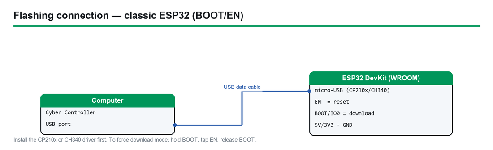

# Custom / Local `.bin` — Bring-Your-Own-Firmware Guide

> **Profile:** Custom / local `.bin` · **Upstream:** none — *you* supply the binary (a firmware not yet in Cyber Controller, or one you built yourself)
> **Chips:** any ESP32-family part — ESP32, ESP32-S2, ESP32-S3, ESP32-C2, ESP32-C3, ESP32-C6, ESP32-C5, ESP32-H2 · **Cyber Controller profile:** `custom` (esptool backend, chip **auto-detect**, lone-image merged@`0x0` default, optional explicit multi-file offsets, **no** suicide/erase-on-flash)
> **This guide:** obtain or build a `.bin` → understand merged-vs-multi-file and offsets → flash it via Cyber Controller → verify it boots → troubleshoot. **You are responsible for whatever firmware you flash.**

## 1. Overview
This is the **meta profile**. Every other profile in Cyber Controller targets one specific firmware with a pinned download, a known board list, and a protocol parser. The **`custom`** profile targets *nothing* and *everything*: it lets you flash **any precompiled ESP32 `.bin` you already have on disk** — a firmware Cyber Controller doesn't ship a profile for yet, a pre-release build from a project's CI, or your own PlatformIO / Arduino / ESP-IDF output.

It exists because the flashing machinery (chip auto-detection, correct per-chip bootloader offsets, the `--flash_size detect` safety flag, child-process cleanup) is identical no matter whose firmware you write. The `custom` profile reuses all of that and simply points the flasher at **your** file instead of a downloaded release. Its description in the profile JSON sums it up:

> *"Flash ANY local .bin(s) you provide, with chip-appropriate default offsets. A lone merged image flashes at `0x0`; pass an explicit support map (offset→path) for a full multi-file flash."*

What `custom` does **not** do: there is no upstream repo (`repo: null`, `firmware_urls: {}`), no release resolver (`resolver: local` — `latest_release()` returns `("local", [])`), and no protocol-aware command palette (`protocol: custom`). Cyber Controller can't parse the output of a firmware it doesn't know, so after flashing you drive the device through the **raw serial terminal**, not a per-firmware command set. Think of `custom` as "esptool with a nice UI, integrated into the same Flash/Devices workflow as everything else."

## 2. Legal & Safety
**You are responsible for whatever firmware you flash.** Because this profile flashes *arbitrary* code, the legal and safety picture depends entirely on the binary you choose — Cyber Controller is just the writer.

- **Only flash firmware you trust.** A `.bin` is opaque machine code. Prefer binaries you compiled yourself from source you've read, or official signed/hash-verified releases from a project you trust. A malicious or tampered image can brick the board, exfiltrate over Wi-Fi/BLE, or turn the device into something you didn't intend. **Verify a download's checksum/signature against the project's published value before flashing** (`verify:` the project's release notes for a SHA-256 / GPG signature).
- **Authorized use only.** If the firmware you flash performs Wi-Fi/BLE/RF actions (deauth, beacon spam, evil-AP, jamming, scanning), the same laws that govern those actions on any device apply here — in most jurisdictions transmitting against networks or people you don't own or have **written permission** to test is illegal (US: CFAA/FCC; elsewhere equivalents). **RF jamming firmware is illegal to operate almost everywhere** regardless of the board it runs on. Flashing is not operating, but you are still responsible for what you then do with the device.
- **Know your hardware limits.** Flashing an image built for the wrong chip, wrong flash size, or wrong board can leave the device non-booting (recoverable — see [§8](#8-troubleshooting)) but writing to the wrong external SPI device or forcing a board outside its electrical limits is on you.
- **No safety net from the profile.** `custom` sets `danger: ""` (no built-in danger label) and `supports_suicide: false` — it ships **no** confirmation gating for whatever the firmware later does and **no** Dead Man's Switch wipe. The judgment is yours.

This guide is for flashing firmware you're authorized to run on hardware you own, in a lawful research/engineering context.

## 3. "Hardware" — any ESP32-family board + a data cable
There is no purchase list here, because the whole point is that you bring your own board and binary. The only requirements:

| Need | Detail |
|------|--------|
| **An ESP32-family board** | Any chip esptool/Cyber Controller supports: `esp32`, `esp32s2`, `esp32s3`, `esp32c2`, `esp32c3`, `esp32c6`, `esp32c5`, `esp32h2`. The board can be a bare DevKit, a CYD, an M5 device, a Flipper dev board — anything, as long as your `.bin` was built **for that exact chip** (see [§8](#8-troubleshooting)). `boards: []` in the profile means it imposes no board list. |
| **A real USB data cable** | Not a charge-only cable. Without data lines no COM/tty port appears. |
| **The USB-serial driver** | **CP210x** (most DevKits / official boards), **CH340/CH341** (cheap clones), or native USB-CDC (S2/S3/C-series). No driver → no port. |
| **A matching `.bin`** | The firmware image(s) for your chip — covered in [§4](#4-preparing-your-bin). |
| **A supported esptool** | Cyber Controller calls `esptool` under the hood and needs **`esptool>=4.7,<6`**. v6 removed the `write_flash` / `--flash_size` / `chip_id` aliases this tool relies on; <4.7 predates newer chips (e.g. C5). If yours is out of range, `pip install 'esptool>=4.7,<6'`. |

**Flash size matters.** Many `.bin` images encode a flash-size header. Cyber Controller passes `--flash_size detect` so a 16 MB-header image won't boot-loop a 4 MB board, but if you build your own firmware, build it for the board's actual flash size (`verify:` your board is ≥4 MB if the firmware expects it).

## 4. Preparing your `.bin`
This is the heart of bring-your-own-firmware. Get this right and flashing is trivial.

### 4.1 Where `.bin` files come from
- **A project's GitHub Release / CI artifacts.** Look for assets ending in `.bin` (or a `.zip` containing them). Projects ship one of two shapes:
  - a single **merged** image (often named `*merged*.bin`, `*.merged-flash.bin`, `firmware-full.bin`, or the asset a web-flasher uses), **or**
  - **separate** `bootloader.bin`, `partitions.bin` (a.k.a. `partition-table.bin`), sometimes `boot_app0.bin`, and the **app** (`firmware.bin` / `*.ino.bin`).
- **Your own PlatformIO build.** Output lands in `.pio/build/<env>/`:
  - app: `firmware.bin` · bootloader: `bootloader.bin` · partitions: `partitions.bin`.
  - `pio run -v` prints the exact `esptool write_flash` line **with the offsets** PlatformIO would use.
- **Your own Arduino IDE build.** *Sketch → Export Compiled Binary* writes next to the sketch:
  - `Sketch.ino.bin` (app), `Sketch.ino.bootloader.bin`, `Sketch.ino.partitions.bin`.
  - Standard ESP32 Arduino offsets: bootloader `0x1000`, partitions `0x8000`, `boot_app0` `0xE000`, app `0x10000`.
- **Your own ESP-IDF build.** `idf.py build` produces `build/<project>.bin` (app), `build/bootloader/bootloader.bin`, `build/partition_table/partition-table.bin`. **`idf.py flash` prints every offset**, and `build/flasher_args.json` lists them in its `flash_files` map.
- **Web-flasher manifests (ESP Web Tools).** A `manifest.json` lists `parts` as `{path, offset}` — usually a single merged image at `0x0`.

### 4.2 Merged single-`.bin` vs multi-file
This distinction determines the offset you flash at — get it wrong and the board won't boot.

| Image model | What it is | How to flash |
|-------------|-----------|--------------|
| **Merged single `.bin`** (`merged-single-bin`) | One file that already contains bootloader + partition table + (`boot_app0`) + app, each pre-placed at its correct internal address. | Flash the **whole file at `0x0`**. Simplest path — and the **default** for `custom`. |
| **Multi-file (offsets)** (`multi-file-offsets`) | The app `.bin` plus *separate* bootloader/partitions/(`boot_app0`) files. The app alone is **not bootable** on a blank chip. | Write **each file at its own offset** (table below). The app goes at its app offset (typically `0x10000`). |

**Cyber Controller's `custom` profile defaults to the merged model** (`image_model: merged-single-bin`, `app_offset: 0x0`). When you hand it a lone `.bin`, it writes that one file at `0x0` — correct for a merged image. If all you have are *separate* bootloader/partition/app files, you have two options:

1. **Merge them first** with esptool, then flash the merged result at `0x0` (recommended — turns a multi-file image into the easy case):
   ```
   esptool --chip esp32 merge_bin -o merged.bin \
     0x1000 bootloader.bin 0x8000 partitions.bin 0xe000 boot_app0.bin 0x10000 app.bin
   ```
   (Use your chip and your project's real offsets; for S3/C3/C6/H2 the bootloader is `0x0`, for C5 it's `0x2000`.)
2. **Provide an explicit multi-file flash** via the `flash_local()` "support map" — see [§5.3](#53-multi-file-via-the-support-map) and [§6](#6-integration-the-custom-profile).

### 4.3 Standard offsets (and how to find a project's)
The "always" offsets (partition table, `boot_app0`, app) are constant across chips; only the **bootloader** offset varies by chip family:

| Region | Offset | Notes |
|--------|--------|-------|
| **Merged single image** | **`0x0`** | The merged blob always starts at zero — this is the `custom` default. |
| **Bootloader — classic ESP32 / S2** | **`0x1000`** | |
| **Bootloader — S3 / C2 / C3 / C6 / H2** | **`0x0`** | RISC-V parts + S3 place the 2nd-stage bootloader at zero. |
| **Bootloader — ESP32-C5** | **`0x2000`** | The C5 ROM expects it here — *not* `0x0`, *not* `0x1000`. Flashing a C5 bootloader at `0x0` yields a board that never boots. |
| **Partition table** | **`0x8000`** | Same on every chip. |
| **`boot_app0`** | **`0xE000`** | Only present in some build flows (e.g. Arduino). Omit if your project omits it. |
| **App** | **`0x10000`** | The default app-only offset for multi-file images. |

**How to find a specific project's offsets (don't guess if it's non-standard):**
- **ESP-IDF:** open `build/flasher_args.json` — the `flash_files` object maps `offset → file` exactly. `idf.py flash` also echoes them.
- **Arduino:** run an upload with verbose output on (*File → Preferences → Show verbose output during upload*, or `arduino-cli upload -v`); the printed `esptool write_flash` command lists every offset.
- **PlatformIO:** `pio run -v` (or `pio run -t upload -v`) prints the `write_flash` command with offsets.
- **ESP Web Tools project:** read the `manifest.json` `parts[].offset` values.
- **A project's README / `flash.sh` / `RUN_THIS.bat` / `flash.bat`:** these almost always hard-code the offsets the maintainer uses — the source of truth when in doubt.

> If a project ships a **merged** image, you can ignore all of this and flash at `0x0`.

## 5. Flashing a local `.bin` via Cyber Controller



*How to connect the board to flash it (classic ESP32 — BOOT/EN download mode).*

Cyber Controller's Flash tab loads firmware via a small **profile JSON**, and the `custom` profile's job is to carry a pointer to your local file. The cleanest way to flash an arbitrary `.bin` is to write a tiny local profile JSON and load it.

### 5.1 Write a one-off local profile (recommended, most explicit)
Create a small JSON file (e.g. `my-firmware.json`) pointing at your `.bin`:

```json
{
  "id": "custom",
  "name": "My firmware (local)",
  "local_path": "C:/path/to/your/merged.bin",
  "chip": "auto",
  "flash_baud": 921600
}
```
- `id: "custom"` selects this profile's machinery.
- `local_path` is your `.bin` (a **merged** image — it will be written at `0x0`).
- `chip: "auto"` lets Cyber Controller detect the chip; set it explicitly (`"esp32s3"`, `"esp32c5"`, …) if you want to force it.
- `flash_baud` is optional (default `921600`).

### 5.2 Flash it
1. **Install the USB-serial driver** for your board (CP210x / CH340 / native), then connect the board by USB.
2. Open Cyber Controller → **Flash** tab.
3. **Port:** pick the board's COM/tty in the *Port* card (click **Refresh** if it's missing → driver/cable issue).
4. **Firmware Profile:** click **Browse...** (next to the profile dropdown) and select your `my-firmware.json`. It loads into the dropdown and becomes the active profile.
   *(The picker's file filter is JSON profiles. `verify:` whether your build also lets Browse target a `.bin` directly; the documented, reliable path is the local-profile JSON above.)*
5. **Chip:** leave **Board / variant** on *Auto* — for `custom` the chip is resolved as **explicit profile `chip` → board chip → auto-detect via `esptool chip_id`**. The flash log prints `[chip] detecting...` then `[chip] using <chip>`.
6. Click **Flash**. Cyber Controller writes your `local_path` `.bin` at **`0x0`** (merged default), with `--flash_size detect` for safety, at the chosen baud. Watch the **Flash Log** and progress bar; "Flash complete" means esptool returned success.

### 5.3 Multi-file via the support map
The Flash-tab local-profile flow writes **one** file at `0x0` (the merged case). For a genuine **multi-file** flash — separate bootloader/partitions/app each at its own offset — the underlying `flash_local()` surface accepts a `support` map (`offset → path`) plus an `app_offset`; supplying it switches the flash to "full" mode. If your build doesn't expose this in the UI, the robust workaround is [§4.2 option 1](#42-merged-single-bin-vs-multi-file): **`esptool merge_bin`** your separate files into one image and flash that at `0x0`. *(`verify:` whether your Cyber Controller build surfaces the support-map / per-offset picker in the Flash tab.)*

### 5.4 Worked example — the Evil-M5 family (Cardputer / StickC / Core2 / …)
A concrete, common case for this profile. **Evil-M5** (`7h30th3r0n3/Evil-M5Project` — the unified successor to the old *Evil-Cardputer* / *Evil-M5Core* / *Evil-M5Core2* projects; the `Evil-M5Core2` repo now redirects here) is a WiFi suite for M5Stack devices centered on **Evil Portal** (captive-portal / credential-capture). Cyber Controller ships **no `github_release` profile** for it — its GitHub **Releases page is empty**. But it does **not** need M5Burner: the maintainer commits **prebuilt merged `.bin` images straight into the repo tree** at [`binaries/`](https://github.com/7h30th3r0n3/Evil-M5Project/tree/main/binaries), so it's a textbook bring-your-own-`.bin` flash — download the one for your board, flash it at `0x0`.

> **Authorized use only.** Evil Portal stands up a fake captive portal to harvest credentials. Run it **only** against networks/people you own or have **written permission** to test. See [§2](#2-legal--safety).

**Pick your image** (from `binaries/`, versions are in the filename — there is no "latest" pointer, so sort by version; newest as of 2026-07-03 shown):

| M5 board | Example file in `binaries/` | Chip (`chip:`) | Flash | Notes |
|----------|-----------------------------|----------------|-------|-------|
| **M5Cardputer** | `Evil-Cardputer-v1-5-3.bin` | `esp32s3` | 8 MB | the common one |
| **M5Cardputer ADV** | `Evil-ADV-V1.4.5.bin` | `esp32s3` | 8 MB | |
| **M5Cardputer (C5 build)** | `Evil_Cardputer_v1_5_1_C5_serial.bin` | `esp32c5` | 8 MB | set `chip` **explicitly** — don't auto-detect a C5 |
| **M5StickC / StickC Plus** | `Evil-Stick-Beta.bin` | `esp32` | 4 MB | beta |
| **M5Core2** | `Evil-Core2-v1.3.9.bin` (or `Evil-M5Core2.bin`) | `esp32` | 16 MB | needs a **16 MB** board |
| **M5CoreS3 (Core3)** | `Evil-Core3-v1.1.9.bin` | `esp32s3` | 16 MB | |
| **M5AtomS3** | `Evil-AtomS3-v1.1.7.bin` | `esp32s3` | 16 MB | |
| **M5Stack Fire** | `Evil-Fire-v1.3.9.bin` | `esp32` | 16 MB | |
| **CYD (1-USB / 2-USB)** | `Evil-CYD1USB-Beta.bin` / `Evil-CYD2USB-Beta.bin` | `esp32` | ~2 MB | beta |

**Flash it:**
1. Open the repo's [`binaries/`](https://github.com/7h30th3r0n3/Evil-M5Project/tree/main/binaries) folder, click the newest `.bin` for **your** board, and **Download raw** (the file itself, not the HTML page).
2. These are **merged full-flash images** — the main ones are exactly the board's flash size (Cardputer = 8 MB, Core2/AtomS3 = 16 MB), so they flash **whole, at `0x0`**: the `custom` default. Nothing to merge or offset.
3. Write a local profile per [§5.1](#51-write-a-one-off-local-profile-recommended-most-explicit) pointing `local_path` at your download, and set **`chip`** to the value in the table (the Cardputer C5 build especially — force `"esp32c5"`, don't rely on auto-detect):
   ```json
   { "id": "custom", "name": "Evil-M5 Cardputer (local)", "local_path": "C:/path/to/Evil-Cardputer-v1-5-3.bin", "chip": "esp32s3" }
   ```
4. Flash per [§5.2](#52-flash-it). If it flashes clean but won't boot, the usual suspect is a **flash-size mismatch** (a 16 MB Core2 image on a smaller board) or a rare app-only build — see [§8](#8-troubleshooting).

**One real caveat:** the repo publishes **no checksums** for these `binaries/`, so there's nothing to verify a download against ([§2](#2-legal--safety) — prefer building from source if you need provenance). This in-repo-binaries layout is also why a future Cyber Controller **repo-tree resolver** (not a `github_release` one) could eventually automate the pick — until then, this manual local-`.bin` path is the supported route.

## 6. Integration (the `custom` profile)
- **Profile facts** (`src/config/profiles/custom.json`): `id: custom`, `backend: esptool`, `protocol: custom`, `boards: []`, `default_baud: 921600`, `repo: null`, `firmware_urls: {}`, `danger: ""`, `supports_suicide: false`, `image_model: merged-single-bin`, `resolver: local`, `app_offset: 0x0`, `variants_for_chip: all`, `default_variant: first`.
- **No remote anything.** `latest_release()` returns `("local", [])` and `support_files()` returns `None` — there's nothing to download. As the profile note says: *"No GitHub repo — the user points at local files via the bespoke `flash_local()` / `local_asset()` surface … the engine has a dedicated custom branch."*
- **The flash path.** In the engine (`flash_engine._flash_esptool`): it first resolves the chip (**explicit → board → `esptool chip_id` auto-detect**, falling back to `esp32`), then — because the profile carries a `local_path` — routes to the dedicated custom branch:
  ```
  custom = flash_core.get_profile("custom")
  custom.flash_local(port, chip, profile.local_path, on_line, baud=profile.baud)
  ```
  `flash_local(...)` flashes the app at `app_offset` (**`0x0`** default = merged blob) unless a `support` map is passed, in which case it does a full multi-file write (`mode = "full" if support else "app"`).
- **`local_asset(path, chip=None, offset="0x0", merged=True)`** is the helper that builds the asset descriptor for a local file — useful if you script the flash rather than using a profile JSON.
- **Chip auto-detect** is firmware-agnostic and shared by every profile: `esptool chip_id` output is matched against `ESP32-S3/S2/C6/C5/C3/C2/H2` tokens, else plain `ESP32`. This is why `chip: "auto"` "just works" for most boards — but set it explicitly if detection is flaky or the board reports oddly.
- **No protocol parser, no command palette, no Cross-Comm routing, no Dead Man's Switch** for `custom` — `protocol: custom` and `supports_suicide: false`. After flashing you interact through the raw serial terminal ([§7](#7-usage)).
- **Backup before overwriting.** The Flash tab's **Backup** button dumps the current flash to a `.bin` first — do this if you might want to restore the board's prior firmware.

## 7. Usage
Because Cyber Controller doesn't know your firmware's protocol, "usage" is **verify it boots, then talk to it raw**.

1. **Confirm a clean flash.** The Flash Log should end with esptool's success/verify lines and "Flash complete." A "Hash of data verified" line (when present) means the written image matches.
2. **Verify it boots.** Go to the **Devices** tab → select the same port → **Connect**. Open the serial terminal and watch the **boot banner**:
   - A normal ESP32 boot prints a `rst:0x1 (POWERON_RESET)` / `boot:0x...` ROM banner followed by your firmware's own startup output. **Set the terminal baud to the firmware's monitor baud** (commonly `115200`; some firmwares use `921600` or other — `verify:` against the project).
   - A blank screen on a display board, or only the ROM banner with no app output, suggests a wrong offset / wrong chip / wrong board image — see [§8](#8-troubleshooting).
3. **Interact raw.** Type the firmware's own commands into the serial terminal (e.g. a CLI prompt, `help`, etc., per *that* firmware's docs). Cyber Controller relays bytes faithfully but won't colorize or parse them, and won't populate the Targets pool — that's expected for `custom`.
4. **Re-flash / iterate.** For your own builds, rebuild → update `local_path` (or overwrite the same path) → Flash again. No need to erase between compatible builds, though a full erase resolves layout changes (see below).

## 8. Troubleshooting
- **No COM/tty port:** install the CP210x/CH340 driver; swap to a **data** cable; on Linux add your user to `dialout` and replug.
- **"A fatal error occurred: Failed to connect to ESP32 / Wrong boot mode":** hold **BOOT** (GPIO0) while plugging in or during connect, then release; lower the flash baud in your profile (`flash_baud`); close any other serial monitor holding the port.
- **Flashes "successfully" but won't boot — wrong offset (merged vs multi-file mistake):**
  - You flashed a **merged** image somewhere other than `0x0` → re-flash at `0x0` (the `custom` default).
  - You flashed only the **app** `.bin` to a blank chip (no bootloader/partitions) → boot-loop with `invalid header: 0xffffffff` or `rst:0x10 (RTCWDT_RTC_RESET)`. Fix: flash the **full** set (bootloader@chip offset + partitions@`0x8000` + app@`0x10000`), or `esptool merge_bin` them and flash at `0x0` ([§4.2](#42-merged-single-bin-vs-multi-file)).
  - **C5 specifically:** bootloader must be at **`0x2000`**, not `0x0`/`0x1000` — a C5 image with the bootloader at the wrong offset never boots.
- **Won't boot — wrong chip:** an image built for a *different* chip (e.g. S3 binary on a classic ESP32) won't run. Confirm the detected chip in the Flash Log (`[chip] using ...`) matches what your `.bin` was built for; set `chip` explicitly if auto-detect guessed wrong. Independently confirm the silicon with `esptool --port <port> chip_id`.
- **Flash-size / 16 MB-header boot-loop:** Cyber Controller passes `--flash_size detect` to avoid this, but if you built the firmware, build it for the board's actual flash size.
- **esptool errors about unknown commands/options:** your esptool is out of range — install **`esptool>=4.7,<6`** (v6 removed the aliases this tool uses; very old versions don't know newer chips).
- **Brick recovery (board unresponsive / boot-loops after a bad flash):** click **Erase Flash** in the Flash tab to fully erase the chip, then re-flash with a **known-good merged image at `0x0`** for the correct chip. A full erase clears stale partition tables and NVS that can survive a partial flash. (`custom` has `supports_suicide: false`, so Erase Flash is a plain chip erase, not a secure-wipe bundle.)
- **Verify failed:** re-flash with verify on; the usual causes are a flaky cable, a clone flash chip, or too-high baud — lower `flash_baud` and retry.
- **Booted but the serial terminal shows garbage:** wrong terminal baud — match the firmware's monitor baud (often `115200`).

## 9. Sources
- **esptool** (the backend Cyber Controller drives): write_flash, `merge_bin`, `chip_id`, flash offsets and memory layout — <https://docs.espressif.com/projects/esptool/> (`verify:` your installed version is `>=4.7,<6`).
- **Espressif build/flash flows for finding offsets:** ESP-IDF `idf.py flash` output and `build/flasher_args.json`; Arduino *Export Compiled Binary* + verbose upload; PlatformIO `pio run -v`; ESP Web Tools `manifest.json` `parts[].offset`.
- **Cyber Controller profile & engine:** `src/config/profiles/custom.json` (`backend: esptool`, `resolver: local`, `image_model: merged-single-bin`, `app_offset: 0x0`, `supports_suicide: false`); `flash_core.CustomLocalProfile` (`flash_local()`, `local_asset()`, `latest_release() → ("local", [])`); `flash_engine._flash_esptool` (chip resolve → `local_path` custom branch); per-chip bootloader offsets in `flash_core._bootloader_offset` / `_BOOTLOADER_OFFSET` (C5 → `0x2000`).
- **Evil-M5 worked example ([§5.4](#54-worked-example--the-evil-m5-family-cardputer--stickc--core2-)):** `7h30th3r0n3/Evil-M5Project` — GitHub **Releases empty**; prebuilt merged images live in the repo tree at <https://github.com/7h30th3r0n3/Evil-M5Project/tree/main/binaries> (per-board `.bin`, flash-size-matched, written at `0x0`). `Evil-M5Core2` redirects to this repo. Board→chip mapping and versions read from the `binaries/` listing on 2026-07-03 (`verify:` the newest version for your board — filenames carry the version, there is no "latest" symlink). No published checksums.
- **Offsets used above** come from the profile JSON + Cyber Controller's flash core (merged@`0x0`; bootloader `0x1000` classic/S2, `0x0` S3+RISC-V, `0x2000` C5; partitions `0x8000`; `boot_app0` `0xE000`; app `0x10000`). For a **specific** project always confirm against that project's own flash script / `flasher_args.json` — *if a value isn't in the JSON or your project's docs, verify it before flashing.*
