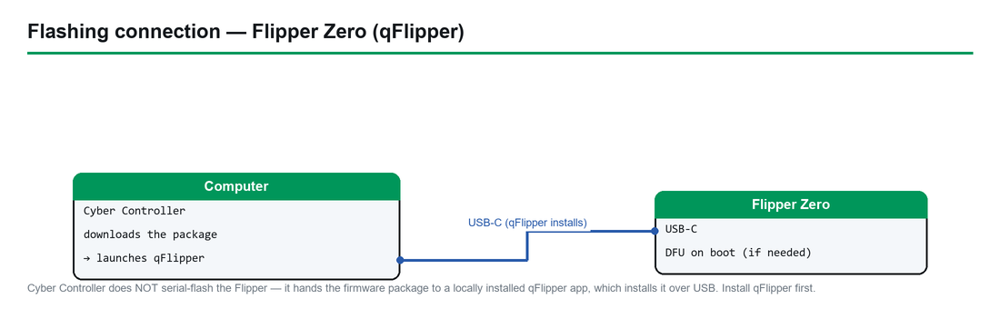

# Flipper Zero — Unleashed Firmware — Complete Hardware Guide

> **Firmware:** Flipper Zero Unleashed · **Upstream:** [DarkFlippers/unleashed-firmware](https://github.com/DarkFlippers/unleashed-firmware) (GPL-3.0)
> **Device / Chip:** Flipper Zero (STM32WB55) · **Cyber Controller profile:** `flipper-unleashed` (qflipper backend, merged single-package install, no suicide)
> **This guide:** purchase → set up → install via qFlipper → integrate into Cyber Controller → use → troubleshoot.

## 1. Overview
Unleashed is a popular independent custom firmware for the **Flipper Zero**, a pocket multi-tool built
around an STM32WB55 microcontroller. It is API-compatible with the official firmware but adds expanded
Sub-GHz protocol support, configurable extended frequency ranges, **removal of regional TX restrictions
(where the user enables them)**, external CC1101 module support, BadUSB keyboard layouts, richer NFC/RFID
parsers, and a large set of community plugins (TOTP, barcode/GPIO/GPS tools, games). Unlike the ESP32
firmwares Cyber Controller flashes over serial with esptool, Unleashed ships as a **packaged firmware
bundle** (`.tgz`/`.tar.gz`/`.zip`) that is installed by the external **qFlipper** desktop application —
Cyber Controller downloads the correct package and hands it off to qFlipper rather than touching the chip
directly.

## 2. Legal & Safety
**Authorized use only.** Unleashed can **remove the region-based Sub-GHz transmit limits** that stock
firmware enforces and can extend the radio into frequencies outside the normal bands. **Transmitting on
restricted, licensed, or out-of-band frequencies — and replaying/sending captured Sub-GHz, NFC, or RFID
signals against devices, vehicles, gates, or access systems you do not own or lack written permission to
test — is ILLEGAL in most jurisdictions** (US: FCC Part 15 / CFAA; EU and others similar). Enabling the
region-unlock and "Dangerous Settings" frequency ranges is **your responsibility, and you alone are
liable for lawful, authorized use.** Upstream additionally warns that transmitting on frequencies the
CC1101 power amplifier is not tuned for **can physically damage the Flipper's hardware** (verify in the
Unleashed docs before raising power/range). The project itself states it "is intended solely for
experimental purposes and is not meant for any illegal activities." Cyber Controller surfaces dangerous
actions with confirmations; that does not make any given transmission lawful where you are.

## 3. Hardware & Purchasing
Unleashed runs on **one device: the Flipper Zero** (there are no board variants to choose). Buy the
genuine unit — upstream explicitly warns about scammers and clones claiming affiliation.

| What | Item | Notes | Where to buy (search terms) |
|------|------|-------|------------------------------|
| The device | **Flipper Zero** (STM32WB55, ~US$169 MSRP — *verify current price*) | Single SKU; Unleashed works on all hardware revisions (incl. early v1.0 units) | Official store **flipper.net** / **shop.flipperzero.one**; resellers list at flipper.net/pages/resellers |
| Verified resellers | **Lab401**, **Micro Center**, **Mouser/DigiKey** regional | Avoid unknown marketplaces/clones; *verify the seller is on the official resellers page* | Search "Flipper Zero" on **Lab401**, **Micro Center**; flipper.net resellers page |
| Storage | **microSD card** (FAT32, ≤256 GB) | Required — firmware bundle, apps, and captures live on the SD card | Any reputable brand; "microSD 32GB" |
| Cable | **USB-C data cable** (not charge-only) | Needed for qFlipper install and Cyber Controller control | Generic USB-C data cable |
| Optional radio | **External CC1101 / NRF24 GPIO module** | Unleashed supports external Sub-GHz modules for better range | Search "Flipper Zero CC1101 external module" |
| Optional | **WiFi Dev Board (ESP32-S2)** | For WiFi apps / Marauder companion (separate profile) | Flipper official store |

**Accessories to avoid:** non-genuine "Flipper" units and charge-only cables (no data line = no COM port,
no qFlipper). Verify availability and price at purchase time — vendor links and stock change.

## 4. Building / Assembly
The Flipper Zero is a **finished consumer device — there is no assembly**. Setup is:
- **Insert a FAT32 microSD card** (≤256 GB). Unleashed stores the firmware bundle, installed apps, and all
  captures on it; without a card many features and the update flow will not work.
- **Install qFlipper** (the official desktop app from flipperdevices/qFlipper) on the same machine as
  Cyber Controller — this is the tool that actually applies the package. Cyber Controller does **not**
  serial-flash the STM32WB55; it relies on a **locally installed qFlipper**.
- **USB / drivers:** the Flipper enumerates as a native USB CDC serial device. On Windows 10/11, macOS,
  and modern Linux it generally needs **no extra driver**; on Linux add your user to the `dialout` group
  and replug if the port doesn't appear.
- **Firmware bundle:** Unleashed releases publish the standard firmware package plus optional extra-apps
  packs. The default build (Cyber Controller's `{"strategy": "first"}` asset pick) is the right choice for
  most users; pick a specific asset only if you know you need a variant.

## 5. Installing Unleashed (via Cyber Controller → qFlipper)

*Cyber Controller hands the firmware package to qFlipper, which installs it over USB-C.*

Cyber Controller's role here is **package delivery, not chip flashing**: it resolves and downloads the
correct Unleashed release, then hands the package to your locally installed **qFlipper**, which performs
the install.

1. **Install qFlipper first** (official desktop app). Cyber Controller's `qflipper` backend invokes it.
2. Connect the Flipper Zero by **USB-C data cable**; ensure a microSD card is inserted.
3. In Cyber Controller open the **Flash** tab → **Firmware Profile: `Flipper Zero — Unleashed`**.
4. Cyber Controller resolves the latest release from
   `https://api.github.com/repos/DarkFlippers/unleashed-firmware/releases/latest`, matching a
   `.tgz` / `.tar.gz` / `.zip` asset, and **downloads the package**.
5. Click **Install**. Cyber Controller launches/feeds **qFlipper**, which uses **"Install from file"** to
   apply the downloaded package — qFlipper unpacks the bundle, transfers it to the Flipper, and the device
   self-applies the update (the merged single package installs at the firmware origin; **qFlipper handles
   all placement — there are no manual offsets** to set as there are for esptool boards). Expect roughly a
   couple of minutes; the Flipper reboots into Unleashed.
6. **Alternative paths (manual, outside Cyber Controller):** the official **web updater** at
   web.unleashedflip.com (Chromium/WebSerial), or manual SD-card update — extract the `.tgz` and place the
   `f7-update-<version>` folder into an `update/` folder at the SD root, then apply on-device. Use these if
   qFlipper is unavailable. *Verify the current method names in §9 before relying on them.*

## 6. Integrate into Cyber Controller
- **Profile:** `flipper-unleashed` — **backend `qflipper`** (NOT esptool/serial), **protocol `flipper`**,
  image model **merged single-package** (`app_offset 0x0`, but qFlipper abstracts placement), resolver
  `github_release` against `DarkFlippers/unleashed-firmware`. The board entry is fixed to the **Flipper
  Zero / STM32WB55 (1 MB flash)** and the chip maps to `flipper`.
- **No suicide / Dead Man's Switch:** this profile sets `supports_suicide: false` — unlike the Marauder
  profile, Cyber Controller will not offer a self-destruct/erase action here.
- **Control:** because installs go through qFlipper, day-to-day control is via the Flipper's own on-device
  UI and SD-card apps. Cyber Controller's job for this profile is **resolve + download + hand to qFlipper**
  (and surface release info), rather than driving a live serial command palette the way it does for the
  ESP32 firmwares.
- **Update flow:** re-run the Flash tab to fetch a newer Unleashed release; Cyber Controller pulls the new
  package and qFlipper re-applies it.
- **Backup first:** before changing firmware, use **qFlipper's full backup** to dump the device's keys/
  settings so you can restore (Flipper backups are handled by qFlipper, not by a Cyber Controller chip
  dump).

## 7. Usage (end-to-end)
1. **Boot Unleashed:** after install the Flipper reboots; the main menu now exposes Unleashed's extra
   Sub-GHz options, apps, and settings.
2. **Sub-GHz (authorized only):** *Sub-GHz → Read / Read Raw* to capture, *Saved* to replay against gear
   **you own or are authorized to test**. The frequency analyzer and extended protocols are Unleashed
   additions.
3. **Region / frequency unlock:** extended TX ranges live under the **"Dangerous Settings"** /
   region-config area. Enabling them removes stock limits — see §2; this is your legal responsibility and
   can damage hardware off-band.
4. **NFC / RFID / iButton / IR:** use the respective menus for read/emulate of credentials you control;
   Unleashed adds parsers and saved-file handling.
5. **BadUSB & apps:** load `.txt` BadUSB scripts (now with keyboard-layout support) and community apps
   from the SD card / Apps catalog.
6. **External module:** attach a CC1101/NRF24 GPIO module and select it in Sub-GHz settings for extended
   range (lawful use only).

## 8. Troubleshooting
- **qFlipper not found / install does nothing:** install the official qFlipper desktop app and ensure
  Cyber Controller can locate it — the `qflipper` backend requires it locally.
- **Device not detected:** use a **data** USB-C cable (not charge-only); try another port; on Linux add to
  `dialout` and replug. Close any other app (qFlipper, web updater, serial monitor) holding the device.
- **"Install from file" fails / package error:** re-download the release in the Flash tab (corrupt/partial
  `.tgz`); confirm a working **FAT32 microSD** is inserted — the update flow needs it.
- **Stuck in recovery / DFU:** use **qFlipper → Repair** to recover, then re-run the Unleashed install.
- **Bricked feel / boot loop:** restore the **qFlipper backup**, or reinstall a known-good Unleashed (or
  official) release via qFlipper.
- **Sub-GHz won't transmit on a frequency:** that band may still be region-locked, or it's outside the
  CC1101's tuned range — re-check region/Dangerous Settings, and re-read §2 (legality + hardware-damage
  risk). *Verify exact menu paths against current docs (§9).*
- **Region unlock concerns:** if unsure whether a frequency is legal where you are, **do not transmit** —
  verify local RF regulations first.

## 9. Sources
- Upstream firmware: <https://github.com/DarkFlippers/unleashed-firmware> (README, features, releases — GPL-3.0).
- Web updater / dev builds: web.unleashedflip.com, dev.unleashedflip.com (verify current URLs upstream).
- Install tool: <https://github.com/flipperdevices/qFlipper> (qFlipper "Install from file", backup, repair).
- Flipper Zero hardware specs: <https://docs.flipper.net/zero/development/hardware/tech-specs> (STM32WB55, CC1101 315/433/868/915 MHz, ST25R3916 NFC, 125 kHz RFID, IR, iButton/1-Wire, 13 GPIO, BLE 5.4).
- Firmware update basics: <https://docs.flipper.net/zero/basics/firmware-update>.
- Cyber Controller profile: `src/config/profiles/flipper_unleashed.json` (backend `qflipper`, protocol `flipper`, board STM32WB55, merged single-package resolver, `supports_suicide: false`).
- Purchasing: official store (flipper.net / shop.flipperzero.one), resellers page (flipper.net/pages/resellers), Lab401, Micro Center — **verify current price and seller authenticity at purchase time**.
