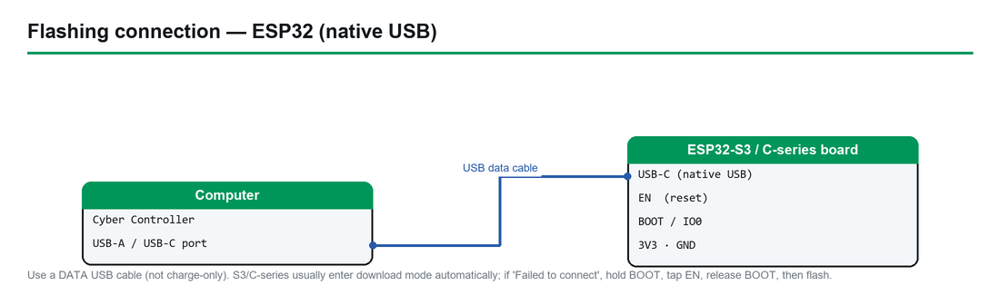

# Flock-You — Complete Hardware Guide

> **Firmware:** Flock-You · **Upstream:** [colonelpanichacks/flock-you](https://github.com/colonelpanichacks/flock-you) (flock cam detection)
> **Chip:** ESP32-S3 (8MB) · **Cyber Controller profile:** `flock-you` (esptool backend, merged single `.bin` @ `0x0`, source-build firmware)
> **This guide:** purchase → build → flash → integrate into Cyber Controller → use → troubleshoot.
> **Detector, not attacker:** Flock-You only *listens*. It transmits nothing and attacks nothing — it is a lawful counter-surveillance / public-awareness tool.

## 1. Overview
Flock-You is a **passive detector for Flock Safety ALPR (automated license-plate reader) cameras** and related
surveillance gear. Running on an ESP32-S3, it puts the WiFi radio into 2.4 GHz **promiscuous (receive-only)
mode** and watches the management and data frames that Flock hardware leaks while trying to phone home —
matching against ~31 known Flock MAC OUI prefixes plus **Information-Element (IE) fingerprinting** of wildcard
SSID probe requests (detection signature `wifi_wildcard_probe_ie_sig`). A companion **BLE** path on the `main`
branch flags Flock and Raven gear by OUI, advertised device name, manufacturer ID `0x09C8`, and Raven service
UUIDs. It runs **standalone** (logging hits to on-board flash, with a buzzer/LED/screen alert depending on
board) or **connected** to a small Flask dashboard over USB for live GPS-tagged mapping and wardriving export.
Cyber Controller flashes the ESP32-S3 image and exposes the device's serial output in the Devices tab. There is
**no offensive command set** here — the firmware emits detection records; it does not take attack verbs.

## 2. Legal & Safety
**This is a receive-only detector — that is the whole point.** Flock-You never transmits 802.11 frames, never
deauths, never associates, and never authenticates. It performs **passive reception of publicly-broadcast
radio frames** for security research, privacy auditing, and public awareness — which is broadly lawful in most
jurisdictions, but **passive RF reception can still be regulated where you live, so check local law.** Use it to
understand surveillance in *your own* environment. **Do not interfere with, jam, deface, or tamper with camera
hardware** — that crosses from detection into illegal conduct. The firmware's own framing: *"always comply with
local laws regarding wireless reception."* Detections are probabilistic (signature/OUI heuristics), so treat a
hit as "worth a look," not proof. Cyber Controller treats this profile as a benign sensor — there are **no
dangerous commands** and **no Dead Man's Switch / suicide** support for this firmware.

## 3. Hardware & Purchasing
Flock-You is built for **ESP32-S3** boards specifically (the Cyber Controller profile ships a single
`ESP32-S3 Generic` board target: 8MB flash, `dio` mode, 80 MHz). The two boards the upstream firmware directly
supports are:

| Tier | Board | Why | Where to buy (search terms) |
|------|-------|-----|------------------------------|
| Smallest / default | **Seeed XIAO ESP32-S3** (env `xiao_esp32s3`) | Thumb-sized, native USB, onboard LED + piezo buzzer alert; the firmware's default target | **Seeed Studio** store; Amazon/AliExpress: "Seeed XIAO ESP32-S3" |
| With screen | **LilyGO T-Dongle-S3** (env `lilygo_t_dongle_s3`) | Integrated **ST7735** TFT + **APA102 RGB LED** (red flash on hit); USB-A stick form factor | **LilyGO** store (lilygo.cc); AliExpress/Amazon: "LilyGO T-Dongle S3" |
| Pre-built kit | **OUI-Spy** (Colonel Panic) | Purpose-built ESP32-S3 (8MB) device from the firmware author; no soldering | **colonelpanic.tech** — *verify: store availability/price at purchase time* |
| Bare / DIY | Any **generic ESP32-S3 DevKit** (e.g. **ESP32-S3-DevKitC-1**, 8MB) | Cheapest serial-only sensor; no screen, drive via Cyber Controller | AliExpress/Amazon: "ESP32-S3-DevKitC-1 N8" |

**Accessories:** a real **USB-C data cable** (not charge-only); optional **USB NMEA GPS puck** for wardriving via
the Flask dashboard (a phone browser's Geolocation API also works); the XIAO can take an external antenna where
a u.FL pad is exposed. **Verify 8MB flash** — the profile and SPIFFS layout assume it; a 4MB clone may fail.
*Verify: a third-party M5 Atom Lite pre-flashed variant is sold by some resellers, but the Atom Lite is plain
ESP32 (not ESP32-S3) and does not match this profile's ESP32-S3 board target — confirm the chip before buying.*

## 4. Building / Assembly
Flock-You is **source-build firmware (PlatformIO)** — upstream publishes no guaranteed pre-compiled binaries
(formal GitHub releases **may 404**; Cyber Controller's flash core tolerates that — see §5).

- **Pre-built boards (XIAO, T-Dongle-S3, OUI-Spy):** no physical assembly — just a data cable.
- **Build from source (the normal path):** install **PlatformIO** (CLI: `pip install platformio`, or the VS Code
  extension), clone the repo, then build/flash your board's environment:
  ```
  git clone https://github.com/colonelpanichacks/flock-you
  cd flock-you
  pio run -e xiao_esp32s3 -t upload          # XIAO ESP32-S3
  pio run -e lilygo_t_dongle_s3 -t upload    # LilyGO T-Dongle-S3
  pio device monitor                          # serial @ 115200
  ```
  To flash via Cyber Controller instead, build **without** upload (`pio run -e xiao_esp32s3`) and grab the merged
  image PlatformIO produces under `.pio/build/<env>/` (*verify the exact filename, e.g. `firmware.bin` vs a
  merged-factory bin*), then point the Flash tab at it.
- **Pin map / peripherals** (handled by firmware — useful for DIY wiring):
  - **XIAO ESP32-S3:** GPIO 3 = piezo buzzer · GPIO 21 = onboard LED (active-low) · GPIO 43 = Serial1 TX mirror
    (115200). Plays the first six notes of the SMB World 1-2 theme on boot.
  - **LilyGO T-Dongle-S3:** GPIO 1–5, 38 = ST7735 (RST/DC/MOSI/CS/SCLK/backlight via TFT_eSPI) · GPIO 39/40 =
    APA102 RGB (clock/data, red on detection). No buzzer.
- **Drivers:** XIAO and T-Dongle-S3 use the ESP32-S3's **native USB** (no CP210x/CH340 needed); a generic
  DevKit with a USB-serial bridge needs its **CP210x/CH340** driver before a COM port appears.

## 5. Flashing & First Run (via Cyber Controller)



*How to connect the board to flash it via Cyber Controller (native-USB ESP32).*

1. Connect the board by USB; open Cyber Controller → **Flash** tab.
2. **Port:** pick the board's COM/tty (click *Refresh* if missing → native-USB enumeration or driver issue).
3. **Firmware Profile:** `flock-you` (backend **esptool**, chip **esp32s3**).
4. **Board:** `ESP32-S3 Generic` (8MB, `dio`, 80 MHz) — the profile's single target; flashed as a **merged
   single `.bin` at offset `0x0`**, baud **115200**.
5. Click **Flash.** Cyber Controller resolves the firmware via the GitHub-release resolver. **Important:**
   because Flock-You is source-build-first, the release lookup **may return no `.bin` (404)**; the profile's
   `on_error: source_only_empty` means the Flash tab can come up **empty with no downloadable asset.** If that
   happens, build the merged image yourself (§4) and select it as a **local/custom firmware file** in the Flash
   tab (*verify the exact custom-file control name in your Cyber Controller build*), then flash to `0x0`.
6. **First boot:** the XIAO chirps its boot tune and the LED activity begins; the T-Dongle-S3 lights its screen
   showing scan status/channel/hit count. On serial (115200) you'll see a `Flock-You ESP32` init banner, then
   one **JSON detection line per hit**.

## 6. Integrate into Cyber Controller
- **Profile:** `flock-you` (esptool; merged single bin @ `0x0`; chip `esp32s3`; 8MB/`dio`/80 MHz; default baud
  115200). `supports_suicide: false`, `protocol: null` — it is a **sensor**, not a command target.
- **Control / monitor:** open the **Devices** tab → select the port → **Connect**. Because the profile has no
  protocol parser, treat the connection as a **raw serial monitor**: the persistent terminal shows the firmware's
  JSON detection lines and status output. There is **no firmware command palette** for Flock-You (no `scanap`/
  `attack`-style verbs) — detection is automatic and continuous on boot.
- **No attack routing:** there are no dangerous verbs to confirm and no Dead Man's Switch for this profile; it
  only emits detections. *Verify whether your Cyber Controller build maps Flock-You JSON lines into the shared
  Targets pool — if not, read them in the terminal or via the Flask dashboard below.*
- **Backup first:** use **Backup** in the Flash tab to dump existing flash before overwriting (especially on an
  OUI-Spy or a board that shipped with other firmware).

## 7. Usage (end-to-end)
1. **Standalone sweep:** power the board from any USB battery and walk/drive. Hits trigger the **buzzer/LED**
   (XIAO) or a **red flash + on-screen popup** (T-Dongle-S3, ~5 s). Detections persist to **SPIFFS**
   (`/session.json`, atomic CRC-protected; autosave ~60 s; up to ~200 unique MACs) and survive power loss.
2. **Monitor live in Cyber Controller:** Devices tab → Connect → read the JSON detection stream in the terminal
   (115200).
3. **Mapping / wardriving (Flask dashboard):** connect the board by USB to a host running the bundled dashboard:
   ```
   cd api
   pip install -r requirements.txt
   python flockyou.py        # open http://localhost:5000
   ```
   It ingests the firmware's JSON lines, tags them with GPS (USB **NMEA puck** on the host, or the phone
   **browser Geolocation API**), does temporal matching, and **exports JSON / CSV / KML** (KML opens in Google
   Earth). The BLE companion firmware also serves its own WiFi AP at `192.168.4.1` with the same JSON schema.
4. **Tune sensitivity (rebuild required):** edit the top of `main.cpp` before building — `CHANNEL_MODE`
   (custom 11/6/1 descend, full 11→1, or single), `CHANNEL_DWELL_MS` (350), `RSSI_MIN` (−95 dBm), per-MAC
   cooldown (~5 s), `MAX_DETECTIONS` (200).
5. **Interpret responsibly:** a hit means a Flock-signature device is *nearby on the air* — investigate lawfully;
   do not touch the hardware.

## 8. Troubleshooting
- **No COM port:** for XIAO/T-Dongle-S3 (native USB) try another **data** cable and re-plug; for a generic
  DevKit install the **CP210x/CH340** driver. On Linux add your user to `dialout` and replug.
- **Flash tab shows no firmware to download:** expected for source-build firmware — the GitHub-release lookup
  404'd (`source_only_empty`). **Build the merged bin with PlatformIO** (§4) and flash it as a local/custom file
  to `0x0`.
- **"Failed to connect" while flashing:** hold **BOOT** (and tap **RESET**) to force download mode, lower the
  flash baud in Settings, and close any serial monitor (including `pio device monitor` or the Devices tab)
  holding the port.
- **Boots but no detections:** normal in a clean RF area; confirm it's scanning (XIAO boot tune / T-Dongle
  status line / serial banner). Loosen `RSSI_MIN` or switch `CHANNEL_MODE` to full hop and rebuild if you expect
  hits but see none.
- **Blank screen on T-Dongle-S3:** wrong build environment — flash the `lilygo_t_dongle_s3` image, not the XIAO
  one (the display pins/driver differ).
- **No buzzer/LED on T-Dongle-S3:** by design — that board has no buzzer; it alerts via the **APA102 RGB LED**
  and screen instead.
- **Flask dashboard empty:** confirm the board is on USB at **115200**, that no other app holds the port, and
  that `pip install -r requirements.txt` succeeded; open `http://localhost:5000`.
- **Boot-loop / brick:** **Erase Flash** in the Flash tab, then re-flash; verify the board is genuinely **8MB**
  ESP32-S3 (4MB clones break the SPIFFS layout).

## 9. Sources
- Upstream: <https://github.com/colonelpanichacks/flock-you> — README, PlatformIO envs (`xiao_esp32s3`,
  `lilygo_t_dongle_s3`), pin maps, `api/` Flask dashboard, detection signatures, channel/SPIFFS config.
- Cyber Controller profile: `src/config/profiles/flock_you.json` — id `flock-you`, esptool backend, chip
  `esp32s3` (8MB/`dio`/80 MHz), merged single bin @ `0x0`, baud 115200, `supports_suicide: false`,
  `protocol: null`, `github_release` resolver with `on_error: source_only_empty`.
- Hardware: **Seeed Studio** (XIAO ESP32-S3), **LilyGO** (T-Dongle-S3), **Colonel Panic** (OUI-Spy,
  colonelpanic.tech), generic ESP32-S3-DevKitC-1.
- Background: Hackaday, "Detecting Surveillance Cameras With The ESP32" (2025-09-26); simeononsecurity Flock-You
  hardware guide (2026). Treat third-party board/price claims as **verify-before-buy**.
- Verify current board availability, prices, release-asset presence, and exact PlatformIO output filenames at
  build/purchase time; vendor links and repo layout change.
