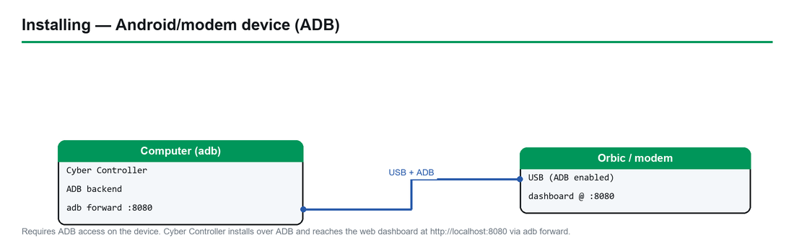

# RayHunter — Complete Hardware Guide

> **Firmware:** RayHunter (EFF IMSI-catcher / cell-site-simulator detector) · **Upstream:** [EFForg/rayhunter](https://github.com/EFForg/rayhunter) (GPL-3.0) · docs: [efforg.github.io/rayhunter](https://efforg.github.io/rayhunter/)
> **Target hardware:** Orbic RC400L mobile hotspot (also branded Kajeet RC400L) + a growing community-supported device list · **Cyber Controller profile:** `rayhunter` (ADB backend, GitHub-release installer, dashboard on :8080)
> **This guide:** purchase → prep → install → integrate into Cyber Controller → use → troubleshoot.
> **Nature:** a **defensive, passive detector** — it only observes the modem's own cellular control traffic. It does **not** transmit, jam, or attack anything.

## 1. Overview
RayHunter is the EFF's open-source detector for **IMSI catchers** — also called **cell-site simulators** or
**Stingrays**. It runs as a small daemon directly on a cheap, Qualcomm-based LTE hotspot, reading the modem's
diagnostic interface (`/dev/diag`) and analyzing the raw cellular control-plane traffic (QMDL). A set of
**heuristics** flags Stingray-style behavior — forced 2G downgrades, null-cipher (unencrypted) sessions,
unauthenticated identity (IMSI/IMEI) requests, and suspicious connection redirects. It records captures
(QMDL/PCAP) for later analysis and exposes a **local web dashboard on port 8080**. Cyber Controller installs
RayHunter over its **ADB backend**, manages the daemon, forwards the dashboard to your workstation, and
checks status — see §6. Note: RayHunter is fundamentally different from the offensive firmwares in this
catalog — there is no attack surface, only detection.

## 2. Legal & Safety
RayHunter is a **lawful, defensive privacy/safety tool**: it passively listens to the radio environment your
own device already sees and never transmits, deauths, or interferes with any network. EFF's own disclaimer:
*"Use this program at your own risk. We believe running this program does not currently violate any laws or
regulations in the United States. However, we are not responsible for civil or criminal liability resulting
from the use of this software."* (§9)
- **Installing the firmware roots/modifies the hotspot** and will **void its warranty**; you do this to a
  device you own.
- A detection alert is **a signal, not proof** — false positives happen (test/lab cells, unusual but
  legitimate carrier behavior). Treat results as leads, corroborate, and don't act on a single red line.
- Carrier terms of service may prohibit modifying the device; that's a contractual matter, separate from law.
- **Verify local law before use outside the US** — wiretap/interception statutes vary, and RayHunter only
  reads control-plane signaling (not call/SMS content), but you should confirm for your jurisdiction.

## 3. Hardware & Purchasing
RayHunter needs a supported hotspot/modem with a **Qualcomm modem exposing `/dev/diag`**. The flagship target
is the **Orbic RC400L**.

| Tier | Device | Region / notes | Where to buy (search terms) |
|------|--------|----------------|------------------------------|
| **Flagship (best-tested)** | **Orbic RC400L** (a.k.a. **Kajeet RC400L** — identical hardware) | Americas; the original RayHunter target | Search **"Orbic RC400L"** on **Amazon** and **eBay**. Used is fine. |
| Recommended (well-tested) | **TP-Link M7350** | Africa / Europe / Middle East (works in Americas but usually pricier) | Search **"TP-Link M7350"** |
| Functional (confirmed) | **Wingtech CT2MHS01** | Americas | Search **"Wingtech CT2MHS01"** |
| Functional | **T-Mobile TMOHS1** | Americas | Search **"TMOHS1 hotspot"** |
| Functional | **TP-Link M7310** | Africa / Europe / Middle East | Search **"TP-Link M7310"** |
| Functional | **PinePhone / PinePhone Pro** | Global | Pine64 store: **"PinePhone"** |
| Functional | **FY UZ801** | Asia / Europe | Search **"UZ801"** |
| Functional | **Moxee hotspot** | Americas | Search **"Moxee hotspot"** |

**Buying the Orbic RC400L:** EFF's guidance is that you **should not pay more than ~US$30** (before shipping);
it's a discontinued/inexpensive US-market LTE hotspot widely available used. It sells under both **Orbic** and
**Kajeet** branding — same hardware, treat them identically. (§9)
- **Specs (verify at purchase):** 4G LTE bands 2/4/5/12/13/48/66; some 5G bands; dual-band WiFi. Primarily a
  **US-market** device — *verify: "check whether the Orbic works in your country"* (EFF) before buying for use
  abroad, as band/carrier support is regional.
- **SIM:** you need a SIM inserted so the radio stack boots and there is real signaling to analyze. A
  **deactivated/expired SIM is sufficient** for the radio to attach enough to observe the environment
  (no active data plan strictly required for detection) — *verify against current EFF docs for your use case*.

**Accessories:** a quality **USB data cable** (not charge-only), a **SIM** (see above), and — only if you go
the manual/advanced route — **Android platform-tools (adb)** on your workstation (Cyber Controller / the EFF
installer can fetch platform-tools automatically; see §5).

## 4. Device Prep & Requirements
There is **no soldering or assembly** — RayHunter is a software install onto a stock hotspot. "Building" here
means getting the device and host ready:
- **Insert a SIM** and power the device on; confirm it boots normally and reaches its admin page at
  **`http://192.168.1.1`** (Orbic) or **`http://192.168.0.1`** (TP-Link).
- **Know the admin password** (the installer needs it for the recommended network install):
  - **Verizon Orbic:** default admin password **= the WiFi password** (printed on the device / inside the
    battery cover).
  - **Kajeet / SmartSpot:** default password is **`$m@rt$p0tc0nf!g`**. (§9)
- **Choose a connection path to the device:**
  - **WiFi / admin-interface (recommended):** join the hotspot's WiFi (or USB-tether) and let the installer
    talk to the admin interface — no ADB driver setup needed.
  - **USB + ADB (advanced):** required only if you want a persistent ADB root shell. On the Orbic this is the
    legacy `orbic-usb` path; it forces the device into debug mode and exposes ADB.
- **Platform-tools / adb:** needed for the USB/ADB path and for Cyber Controller's port-forward + status
  checks. If `adb` isn't found, the EFF installer (and Cyber Controller) can download Google's
  **platform-tools** automatically. The Orbic enumerates as a **Qualcomm USB device (vendor `0x05c6`)**.
- **Firmware-version caveat:** the Orbic's install routine has changed repeatedly across firmware revisions,
  and some firmwares break specific install methods (e.g. *verify:* reports of `ORB400L_V1.2.8_BVZRT` failing
  both `orbic` and `orbic-usb`, upstream issue #901). If one method fails, try the other and check open issues
  (§9).
- **Windows warning:** there are documented **USB-driver problems and bricked Orbics when using ADB on
  Windows**. Prefer the **network (WiFi) install**; reserve the USB/ADB method for Linux/macOS or experienced
  users. (§9)

## 5. Install & First Run (via Cyber Controller)

*Cyber Controller installs over ADB and reaches the device's web dashboard.*

Cyber Controller's **ADB backend** automates the EFF release installer end-to-end (download → verify → run →
forward → status). Manual equivalents are shown so you understand each step.

1. **Connect the device.** Join the hotspot's WiFi (or USB-tether), or connect USB for the ADB path. In Cyber
   Controller open the **Flash / Install** flow and select **Firmware Profile: `rayhunter`**.
2. **Pick install method:**
   - **`network`** (default, recommended): runs the EFF installer against the admin interface. You'll be
     prompted for the **admin password** (and optionally `--admin-username` / `--admin-ip` if you changed the
     defaults). Equivalent CLI: `./installer orbic --admin-password 'YOURPASSWORD'`.
   - **`usb`** (advanced): runs `./installer orbic-usb`, which enables ADB + a root shell. Limited Windows
     support — Linux/macOS preferred.
3. **Install.** Cyber Controller fetches the **latest GitHub release** (`EFForg/rayhunter`, e.g. **v0.11.2** at
   time of writing — *verify latest*), picks the **host-platform asset** (Windows/macOS/Linux × arch),
   **verifies its SHA-256** when a checksum asset is present, extracts the **installer binary**, and runs it
   with your chosen method. The download path is **SSRF-hardened** (GitHub hosts only).
4. **Reboot & first run.** The installer pushes the daemon, config, and init script, then the device reboots.
   On boot you'll see a **green line across the top of the device's display** — RayHunter is running and
   recording.
5. **Reach the dashboard.** Cyber Controller runs `adb forward tcp:8080 tcp:8080` and verifies the daemon by
   polling **`http://localhost:8080/api/analysis`**. Open **`http://localhost:8080`** in your browser. (Over
   WiFi instead of USB, the dashboard is at **`http://192.168.1.1:8080`**.)

> **Advanced / manual install:** for an already-rooted device with a cross-compiled `rayhunter-daemon`, Cyber
> Controller can `adb push` the binary + a default `config.toml` + an init script to `/data/rayhunter/` and
> `/etc/init.d/rayhunter_daemon`, then you reboot. This bypasses the EFF installer entirely.

## 6. Integrate into Cyber Controller
- **Profile:** `rayhunter` — **backend = `adb`**, `protocol = null` (no serial command stream; control is via
  ADB + the HTTP dashboard). The profile id matches the ADB backend registry key `ADB_PROFILES["rayhunter"]`
  (label *"RayHunter IMSI Catcher Detector (EFF)"*, repo `EFForg/rayhunter`, device *Orbic RC400L*,
  `api_endpoint = /api/analysis`, `api_port = 8080`).
- **Device detection:** the ADB backend uses `adb devices` to find the connected hotspot (by serial) and
  `adb wait-for-device` after reboots.
- **Install / update / uninstall:** driven over ADB and the EFF release installer (§5). **`auto_check_updates`
  is OFF** in the config Cyber Controller writes — updates are deliberate, not automatic. The backend can read
  the **installed version** (`rayhunter-daemon --version`) and compare it to the **latest GitHub tag** to tell
  you when an update exists, but won't apply it unprompted.
- **Daemon control:** start / stop / restart the daemon via its init script
  (`/etc/init.d/rayhunter_daemon start|stop|restart`); a liveness check uses `pgrep -f rayhunter-daemon`.
- **Dashboard reachability:** Cyber Controller sets up `adb forward tcp:8080 → tcp:8080` so the dashboard is at
  **`http://localhost:8080`**, and a status check hits **`/api/analysis`** (HTTP 200 = running). If forwarding
  fails, fall back to **`http://192.168.1.1:8080`** over the hotspot's WiFi.
- **Analyzers (config `[analyzers]`):** `imsi_requested`, `connection_redirect_2g_downgrade`,
  `lte_sib6_and_7_downgrade`, `null_cipher`, `nas_null_cipher`, `incomplete_sib`, `diagnostic_analyzer` are
  **on**; `test_analyzer` is **off** (it alerts on every tower — enable only to confirm the pipeline works).
- **Not an attack profile:** RayHunter does **not** participate in Cross-Comm attack routing or the Dead Man's
  Switch — it's a passive sensor. Its value to the rest of the toolkit is **situational awareness** (is the
  local radio environment being tampered with?).

## 7. Usage (end-to-end)
1. **Power on with a SIM**, confirm the **green line** on the device display, and open the dashboard
   (`http://localhost:8080` via USB forward, or `http://192.168.1.1:8080` via WiFi).
2. **Watch the indicator.** Green = running/recording. It changes to **yellow dots → orange dashes → solid
   red** as the heuristics rate a potential IMSI catcher more likely. The dashboard mirrors this with
   per-capture warnings.
3. **Move/monitor.** Carry the device through the area of interest; it records continuously. A recording can
   also be started by **double-tapping the power button** (must be enabled in config). (§9)
4. **Review heuristic analyses** in the dashboard. What each analyzer flags:
   - **IMSI Requested** — a cell asks for your IMSI/IMEI then the connection fails/drops without proper
     authentication (classic catcher fingerprinting).
   - **2G Downgrade (connection release / redirect)** — a base station releases your connection and redirects
     you to a weaker 2G cell where interception is easier.
   - **LTE SIB6/7 Downgrade** — LTE system-information broadcasts advertise 2G/3G at high priority to lure a
     downgrade.
   - **Null Cipher (EEA0, RRC layer)** / **NAS Null Cipher** — the network proposes *unencrypted* signaling,
     abnormal outside test environments.
   - **Incomplete SIB** — system-information blocks lack the full, expected chain from a legitimate tower.
   - **Diagnostic** — connection/disconnection analytics for PCAP review (informational, doesn't alert on its
     own).
5. **Export captures.** From the web UI you can **start/stop recordings, download captures (QMDL/PCAP), delete
   them, and view the analyses**. Pull the PCAP into Wireshark for deeper inspection.
6. **Stop / clean up.** Stop the daemon from Cyber Controller when done; remove the port forward
   (`adb forward --remove tcp:8080`). To remove RayHunter, use the backend's **uninstall** (optionally
   `keep_data` to preserve `/data/rayhunter/qmdl` recordings).

## 8. Troubleshooting
- **Dashboard unreachable / "connection refused":** the port forward isn't active or the daemon is still
  booting — re-run `adb forward tcp:8080 tcp:8080`, wait for reboot, then retry `http://localhost:8080`; or use
  `http://192.168.1.1:8080` over WiFi. Confirm liveness with `pgrep -f rayhunter-daemon` (§6).
- **`adb` not found:** install Android **platform-tools**, or let the installer/Cyber Controller download it;
  on Windows confirm the **Qualcomm (`0x05c6`) USB driver** is present.
- **Installer fails (network method):** wrong **admin password** is the usual cause — Verizon Orbic uses the
  WiFi password; Kajeet/SmartSpot uses `$m@rt$p0tc0nf!g`. Confirm you can load the admin page at
  `192.168.1.1` first.
- **Installer fails on both `orbic` and `orbic-usb`:** likely a **firmware-version mismatch** (e.g. *verify:*
  `ORB400L_V1.2.8_BVZRT`, issue #901). Try the other method, then check upstream issues for your exact
  firmware string (§9).
- **Bricked Orbic / Windows ADB problems:** documented risk — prefer the **network install**; only use
  USB/ADB on Linux/macOS or if experienced. Recovery options are device-specific; check upstream issues (§9).
- **No alerts ever / unsure it works:** temporarily enable **`test_analyzer`** (alerts on every new tower) to
  confirm the capture/analysis pipeline, then turn it back off.
- **Constant red / false positives:** corroborate before believing — lab/test cells and some legitimate
  carrier behavior trip heuristics. A red line is a lead, not a verdict (§2).
- **Device won't attach to network:** ensure a **SIM is inserted** and the device is in a region where it has
  band/carrier support; without a booted radio stack there's nothing to analyze.

## 9. Sources
- Upstream repo: <https://github.com/EFForg/rayhunter> (README, releases, issues — e.g. #901, #518, #130).
- EFF docs: <https://efforg.github.io/rayhunter/> — *Supported devices*, *Installing from the latest release*,
  *Orbic/Kajeet RC400L*, *Using Rayhunter*, *Heuristics* pages.
- Cyber Controller profile: `src/config/profiles/rayhunter.json` (backend `adb`, board Orbic RC400L, release
  URLs, SIM note).
- Cyber Controller ADB backend: `src/core/backends/adb_backend.py` (`ADB_PROFILES["rayhunter"]`,
  install/forward/status logic, default `config.toml` analyzers, `auto_check_updates=false`, port 8080,
  `/api/analysis`, Qualcomm vendor `0x05c6`).
- Verify current device availability, prices, supported-device list, latest release version, and firmware
  caveats at install time — upstream EFF docs are authoritative and the device list/installer change often.
