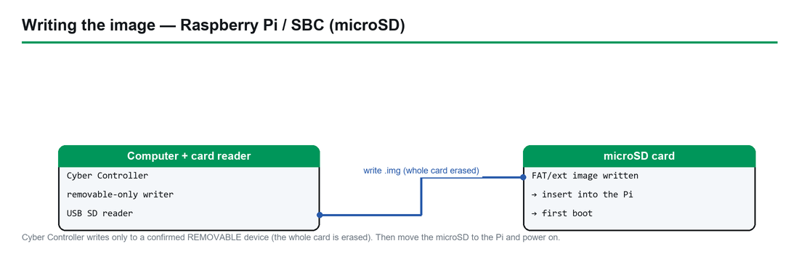

# Tails — Amnesic Live USB — Complete Guide

> **OS:** Tails (The Amnesic Incognito Live System) · **Upstream:** [tails.net](https://tails.net) (Debian-based, Tor Project–affiliated)
> **Type:** USB **image** (`.img`) written whole-disk to a USB · **Cyber Controller catalog id:** `tails` (Software-OS tab; `verify_model = image_sig`) — also a dedicated `--flash-tails` path.
> **This guide:** choose a USB → verify (matters most here) → flash via the Software-OS tab → boot into Tor → set up encrypted Persistent Storage → troubleshoot UEFI/Secure Boot.

## 1. Overview
Tails is a **portable, amnesic** operating system whose whole purpose is privacy and anti-forensics. It
boots from a USB stick, **forces all internet traffic through the Tor network**, and **"leaves no trace on
the computer when shut down"** (tails.net, §9). By default everything you do disappears at shutdown
(it runs from RAM), which is why it's the tool of choice for activists, journalists, at-risk individuals,
and anyone who needs to use a computer without leaving evidence behind. It ships a curated set of
applications with **safe defaults** for working on sensitive documents and communicating securely.
Cyber Controller treats Tails as a first-class image in the **Software-OS tab** and *additionally* exposes
a dedicated **`--flash-tails`** CLI path with Tails-specific verification — because for Tails, getting an
**authentic, untampered** image is part of the threat model, not an afterthought.

## 2. Legal & Safety
Tails is **lawful software** for protecting privacy and circumventing censorship; running it is legal in
most places. Some networks or jurisdictions restrict or scrutinize Tor — *verify local rules and your own
risk model*. Safety notes specific to Tails: (a) flashing **erases the entire target USB**; (b) Tails
protects your *network* identity via Tor but cannot fix operational mistakes (logging into personal
accounts deanonymizes you); (c) the **Persistent Storage is not hidden** — "an attacker in possession of
your USB stick can know that there is a Persistent Storage" and could coerce you for the passphrase
(tails.net, §9). Treat the stick and its passphrase accordingly.

## 3. Hardware & Purchasing
You need **a USB flash drive (8GB minimum)** and a 64-bit PC.

| Item | Recommendation | Notes (tails.net, §9) |
|------|----------------|-----------------------|
| USB stick | **8GB minimum** | "You need a USB stick of 8 GB minimum to use Tails." 16–32GB is nicer for Persistent Storage headroom. **All data on the stick is erased** when installing Tails. |
| Speed | USB 3.x | Tails runs largely from RAM, but a fast stick speeds boot and the Persistent Storage. |
| Host RAM | **3GB recommended** | Less works but risks slowness/instability/crashes. |
| Host CPU | **64-bit x86-64 only** | No ARM or PowerPC. **Does not run on Apple-Silicon Macs (M1/M2/…)**; works on some older Intel Macs and most PCs <~10 yrs old. |

Buy a stick from any reputable retailer (SanDisk/Samsung/Kingston via Amazon, Best Buy, Micro Center,
manufacturer stores). **Always download Tails only from `tails.net`** — never an ad link or mirror you
don't recognize. *Verify: consider a second "throwaway" stick if you'll move the image between machines.*

## 4. Making the bootable USB / partitioning notes
- **Correct file = the USB image `.img`.** Since Tails 5.0 the fresh-install download is a **USB image
  with a `.img` extension**. An `.iso` is the **wrong file** (ISO is for DVD/VM/upgrades only) — Cyber
  Controller's Tails path **refuses an `.iso`** to stop this common mistake.
- **Raw, whole-disk write.** The `.img` is written block-for-block to the entire USB; its partition layout
  replaces anything already on the stick.
- **Don't pre-partition.** Tails creates its own layout. The **Persistent Storage is added later from
  inside Tails** (see §7) and automatically uses *"all the free space left on the USB stick"* — so a
  larger stick simply gives you more encrypted space.
- **Ventoy note:** Tails generally expects to own the whole stick and to manage its own persistence;
  running it from a Ventoy multi-ISO menu is **not the supported install** and can break persistence and
  some security properties. For Tails, prefer a **dedicated stick** written with the official image
  (which is exactly what Cyber Controller's writer does). *Verify on tails.net before relying on any
  multiboot setup.*

## 5. Flash to USB via Cyber Controller's Software-OS tab

*Cyber Controller writes the image to a removable microSD/USB; then boot the device.*

1. Insert the USB. Open Cyber Controller → **Software-OS** tab.
2. **Operating System:** pick **Tails**. Description shows `IMG`, verified via `image_sig`.
3. **Check latest:** Cyber Controller resolves the current Tails release **live** from the official
   installer feed (`tails.net/install/v2/Tails/amd64/stable/latest.json`), reading the `.img` URL +
   SHA-256, and derives the detached signature URL. Offline? tick **"Use bundled version (offline)"** to
   use the pinned catalog image (offline fallback; at time of writing the pinned fallback is `7.9` — the
   live check supersedes it).
4. **Target USB (removable):** select your stick (only removable drives <256GB are listed). **Refresh
   drives** if needed.
5. Click **Flash OS** → confirm the "ERASE EVERYTHING" dialog → it downloads, **verifies the OpenPGP
   signature / SHA-256** (see §6), writes the image, and **reads it back** to confirm.
6. On success: *"Tails USB is ready. Boot the target machine from this USB."*

**Dedicated CLI path:** `cyber-controller --flash-tails [--tails-image <path.img>] [--tails-sha256 <hex>]
[--tails-sig <file.sig>] [--os-target <device>] [--yes]`. It enforces the `.img`-only rule and the full
Tails verification chain. (The generic `cyber-controller --flash-os tails …` works too.)

## 6. Integration with the Software-OS tab (integrity verification)
**Verification matters more for Tails than for any other image here** — an attacker who can swap the image
defeats the entire point of Tails. Cyber Controller therefore pins Tails' identity and refuses bad sigs.

- **Catalog entry** (`src/config/os_catalog.json`): id `tails`, `resolver: tails`, `image_type: img`,
  `verify_model: image_sig`, signing-key fingerprint
  `A490 D0F4 D311 A415 3E2B B7CA DBB8 02B2 58AC D84F` (also hard-pinned in `src/core/tails.py` as
  `TAILS_SIGNING_KEY_FINGERPRINT`).
- **Verification model — `image_sig`:** a **detached OpenPGP `.sig` over the image itself**. Cyber
  Controller fetches the `.sig`, runs `gpg --verify`, and accepts only a **VALID/GOOD signature from the
  pinned Tails key**. A signature that is invalid *or from a foreign key* → **the write is refused**
  (`"GPG signature is NOT valid for the Tails signing key — refusing to write."`).
- **Layered fallback:** if `gpg` isn't installed, the signature check is skipped and Cyber Controller
  falls back to comparing the image's **SHA-256** against the published checksum; a mismatch still refuses
  the write. Only an image with neither a valid signature nor a matching checksum is written — and only
  after an explicit **UNVERIFIED** warning. For Tails, install `gpg` and let the signature path run.
- **`.img` enforcement** and an **HTTPS-only allowlist** of official hosts
  (`tails.net`, `download.tails.net`, `tails.boum.org`, `dl.amnesia.boum.org`) with redirects
  re-validated (anti-SSRF) round out the chain.
- **Manual verification options** Tails also provides (tails.net, §9): in-browser **JavaScript
  verification** of your download, the **OpenPGP signing key** + `.sig` files, or a manual checksum
  compare. Doing the OpenPGP verification yourself once, against the fingerprint above, is the gold
  standard.
- **Post-write read-back:** the backend re-reads the written bytes and re-hashes to confirm the stick
  matches the verified image.

## 7. Booting it / persistence
**Boot:** insert the stick, power on, open the firmware **boot menu** (commonly **F12 / F10 / Esc**, or
**Option** on older Intel Macs — *verify your model*), pick the USB. Tails shows a **Welcome Screen**; set
language/keyboard and optional settings, then **Start Tails**. It connects through **Tor**; by default
nothing is saved.

**Persistent Storage (optional, encrypted):**
- Tails is **amnesic by default** — *"Everything you do disappears automatically when you shut down
  Tails."* To keep selected data, create the **Persistent Storage** (Applications → Tails → Persistent
  Storage, or from the Welcome Screen).
- It is an **encrypted partition using LUKS/dm-crypt** ("the standard system for disk encryption in
  Linux") protected by a **passphrase** — Tails recommends *"a long passphrase made of 5 to 7 random
  words."* It occupies all remaining free space, and **everything in it is encrypted automatically**
  (tails.net, §9).
- You choose **what** persists via toggles: e.g. Welcome-Screen settings, a **Persistent folder** for
  documents, **Wi-Fi passwords**, Tor Browser **bookmarks**, GnuPG keys, and **additional software** and
  fonts (exact toggles vary by version — *verify in the Persistent Storage settings*).
- Security reality (§2): the Persistent Storage is **not deniable** — its presence is detectable, and you
  could be compelled to reveal the passphrase. Plan your threat model accordingly.

## 8. Troubleshooting (boot / UEFI / Secure Boot)
- **USB not offered at boot:** enable USB boot; try another port; disable **Fast Boot**. Use the firmware
  one-time **boot menu** rather than changing permanent boot order.
- **Secure Boot:** modern Tails is built to boot with Secure Boot enabled; if it won't, **disable Secure
  Boot** in firmware, boot Tails, then re-enable afterward. *Verify against the Tails docs for your
  version.*
- **UEFI vs Legacy/CSM:** if it stalls, switch the firmware between **UEFI** and **Legacy/CSM** boot modes
  and retry.
- **"Error starting GDM" / black screen / freezes:** often a graphics-driver issue — Tails documents a
  **Troubleshooting Mode** boot entry and graphics workarounds; some GPUs are known-incompatible
  (tails.net requirements, §9). *Verify the exact entry for your hardware.*
- **Apple-Silicon Mac:** **unsupported** — Tails will not run on M-series Macs (use an Intel Mac or a PC).
- **No Tor / can't connect:** on captive-portal/hostile networks use the Tails **network configuration /
  Tor bridges** options at startup.
- **Persistent Storage won't unlock:** the passphrase is case-sensitive and word-spacing matters; there is
  **no recovery** if it's lost (it's real encryption).
- **Flash failed / stick not removable:** the writer lists only removable drives <256GB; run the app with
  raw-disk privileges (Administrator on Windows; appropriate rights on Linux/macOS). If verification
  failed, **re-download from tails.net** — never boot an unverified Tails image.

## 9. Sources
- Tails home (what it is, no-trace, Tor): <https://tails.net/>
- Install Tails (download + USB image): <https://tails.net/install/>
- Download & verify (JS verification, OpenPGP `.sig`, signing key): <https://tails.net/install/download/>
- System requirements (8GB USB min, RAM, 64-bit, Mac notes): <https://tails.net/doc/about/requirements/>
- Persistent Storage (LUKS, passphrase, what persists): <https://tails.net/doc/persistent_storage/>
- Cyber Controller integration: `src/config/os_catalog.json` (entry `tails`), `src/core/tails.py`
  (`.img`-only rule, pinned signing-key fingerprint, `--flash-tails` CLI), `src/core/os_catalog.py`
  (resolver/verify), `src/core/backends/sd_backend.py` (removable-only write + read-back),
  `src/ui/qt/software_tab.py` (Software-OS tab).
- Verify the current Tails version and signing key at flash time — releases roll forward and the tab
  resolves the latest live.
